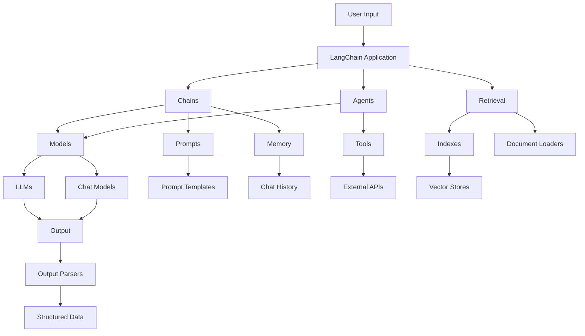

Now that I have scraped the content from the specified URL, I'll create a comprehensive knowledge base document on LangChain based on the guidelines you provided. Here's the structured document:

# LangChain Knowledge Base

Version: 1.0
Last Updated: 2024-03-20

## Table of Contents

1. [Introduction and Overview](#1-introduction-and-overview)
2. [Setup and Environment](#2-setup-and-environment)
3. [Architecture and Core Components](#3-architecture-and-core-components)
4. [LangChain Expression Language (LCEL)](#4-langchain-expression-language-lcel)
5. [Models and Interactions](#5-models-and-interactions)
6. [Prompts and Templates](#6-prompts-and-templates)
7. [Output Parsing and Structured Data](#7-output-parsing-and-structured-data)
8. [Memory and Chat History](#8-memory-and-chat-history)
9. [Document Handling and Retrieval](#9-document-handling-and-retrieval)
10. [Embeddings and Vector Stores](#10-embeddings-and-vector-stores)
11. [Tools and Agents](#11-tools-and-agents)
12. [Callbacks and Event Handling](#12-callbacks-and-event-handling)
13. [Streaming and Real-time Interactions](#13-streaming-and-real-time-interactions)
14. [Evaluation and Tracing](#14-evaluation-and-tracing)
15. [Best Practices and Style Guide](#15-best-practices-and-style-guide)
16. [Common Pitfalls and Troubleshooting](#16-common-pitfalls-and-troubleshooting)
17. [Integration and Ecosystem](#17-integration-and-ecosystem)
18. [AI-Specific Considerations](#18-ai-specific-considerations)
19. [Code Generation Guidelines](#19-code-generation-guidelines)
20. [References and Resources](#20-references-and-resources)

## 1. Introduction and Overview

<overview>
LangChain is a powerful framework designed to simplify the development of applications using large language models (LLMs). It provides a set of tools, components, and interfaces that enable developers to create complex, interactive AI-powered applications with ease.
</overview>

### Key Features

- Modular architecture for flexible application design
- Support for various LLMs and chat models
- Tools for document handling, retrieval, and vector stores
- Prompt engineering and templating capabilities
- Output parsing and structured data handling
- Agent and tool integration for complex task execution
- Streaming and real-time interaction support
- Evaluation and tracing functionalities

### Common Use Cases

- Building conversational AI applications
- Creating question-answering systems over custom data
- Developing AI-powered tools and agents for task automation
- Implementing retrieval-augmented generation (RAG) systems
- Constructing complex chains of LLM-powered operations

### Version Information

LangChain is actively developed and frequently updated. As of the last update to this document, the latest stable version is 0.2.x. It's recommended to check the official documentation for the most up-to-date version information.

### Brief History and Milestones

- LangChain was initially released as an open-source project in October 2022.
- It quickly gained popularity in the AI development community due to its flexibility and ease of use.
- The project has seen rapid development, with frequent updates and new features being added.
- LangChain has become a go-to framework for many developers working on LLM-powered applications.

## 2. Setup and Environment

### Installation

LangChain can be installed using npm, yarn, or pnpm. Here are the commands for each:

<code>
# Using npm
npm i langchain

# Using yarn
yarn add langchain

# Using pnpm
pnpm add langchain
</code>

For specific integrations, you may need to install additional packages. Refer to the official documentation for a list of available integrations and their installation instructions.

### Development Environment

LangChain is primarily used in Node.js environments. Here are some recommendations for setting up your development environment:

1. Use a modern code editor like Visual Studio Code with TypeScript support.
2. Install Node.js (version 18 or later recommended).
3. Use a package manager like npm, yarn, or pnpm for dependency management.
4. Consider using TypeScript for better type checking and autocompletion.

### IDE Recommendations

- Visual Studio Code: Offers excellent TypeScript support and a wide range of helpful extensions.
- WebStorm: A powerful IDE for JavaScript and TypeScript development with built-in features for Node.js projects.
- Atom: A customizable text editor with good support for JavaScript and TypeScript.

### Essential Tools and Libraries

- TypeScript: For type-safe development
- ESLint: For code linting and maintaining consistent code style
- Prettier: For code formatting
- Jest: For unit testing
- dotenv: For managing environment variables

## 3. Architecture and Core Components

LangChain's architecture consists of several key components that work together to provide a flexible and powerful framework for building LLM-powered applications.

### Core Packages

1. **@langchain/core**: Contains base abstractions and interfaces for core components like LLMs, vectorstores, and retrievers. It has minimal dependencies and defines no third-party integrations.

2. **@langchain/community**: Houses third-party integrations maintained by the LangChain community. All dependencies in this package are optional to keep it lightweight.

3. **Partner packages**: Popular integrations are split into separate packages (e.g., langchain-openai, langchain-anthropic) for improved support.

4. **langchain**: The main package containing chains, agents, and retrieval strategies that make up an application's cognitive architecture. These components are generic across all integrations.

5. **LangGraph.js**: An extension of LangChain for building robust and stateful multi-actor applications with LLMs by modeling steps as edges and nodes in a graph.

### Key Components

1. **Models**: Interfaces for interacting with language models (LLMs) and chat models.

2. **Prompts**: Tools for creating and managing prompts for language models.

3. **Chains**: Sequences of operations that can be performed on inputs, often involving multiple model calls or data transformations.

4. **Indexes**: Data structures for efficient storage and retrieval of information, including vector stores.

5. **Memory**: Components for maintaining conversation history or other stateful information.

6. **Agents**: Autonomous entities that can use tools and make decisions to accomplish tasks.

7. **Tools**: Interfaces that allow models to interact with external systems or perform specific actions.

8. **Callbacks**: Mechanisms for hooking into the execution of LangChain components for logging, monitoring, or other purposes.

9. **Document Loaders**: Utilities for loading documents from various sources.

10. **Output Parsers**: Components for parsing and structuring the output from language models.

### Architectural Diagram



This architecture allows for great flexibility in building LLM-powered applications, enabling developers to mix and match components as needed for their specific use cases.

## 4. LangChain Expression Language (LCEL)

LangChain Expression Language (LCEL) is a declarative way to compose chains in LangChain. It's designed to support putting prototypes into production without code changes, from simple "prompt + LLM" chains to complex multi-step processes.

### Key Features of LCEL

1. **First-class streaming support**: Enables the best possible time-to-first-token for chains.

2. **Optimized parallel execution**: Automatically executes steps that can be run in parallel for minimal latency.

3. **Retries and fallbacks**: Allows configuration of retries and fallbacks for any part of the chain, improving reliability at scale.

4. **Access to intermediate results**: Enables access to results of intermediate steps before the final output is produced.

5. **Input and output schemas**: Provides inferred schemas for every LCEL chain, useful for validation of inputs and outputs.

6. **Seamless LangSmith tracing**: Automatically logs all steps to LangSmith for maximum observability and debuggability.

### Runnable Interface

The Runnable interface is a standard protocol implemented by many LangChain components, making it easy to create and invoke custom chains. Key methods include:

- `stream`: Stream back chunks of the response
- `invoke`: Call the chain on an input
- `batch`: Call the chain on an array of inputs

### Example Usage

```typescript
import { ChatPromptTemplate } from "@langchain/core/prompts";
import { ChatAnthropic } from "@langchain/anthropic";
import { StringOutputParser } from "@langchain/core/output_parsers";

const model = new ChatAnthropic({ model: "claude-3-sonnet-20240229" });
const prompt = ChatPromptTemplate.fromTemplate("tell me a joke about {topic}");
const parser = new StringOutputParser();

const chain = prompt.pipe(model).pipe(parser);

const result = await chain.invoke({ topic: "programming" });
console.log(result);
```

This example demonstrates how to create a simple chain using LCEL, combining a prompt template, a chat model, and an output parser.

## 5. Models and Interactions

LangChain supports various types of language models, primarily categorized into Chat Models and LLMs (Language Models).

### Chat Models

Chat models use a sequence of messages as inputs and return chat messages as outputs. They support distinct roles for conversation messages, such as AI, user, and system messages.

#### Key Features

- Support for role-based messaging
- Can accept both string and message inputs
- Standardized parameters for construction (e.g., `model` name)

#### Example Usage

```typescript
import { ChatAnthropic } from "@langchain/anthropic";

const model = new ChatAnthropic({ model: "claude-3-sonnet-20240229" });
const result = await model.invoke("Tell me a joke about programming");
console.log(result.content);
```

### LLMs (Language Models)

LLMs are traditional language models that take a string as input and return a string as output. While generally older, they can still be useful for certain applications.

#### Key Features

- String-in, string-out interface
- Can also accept messages as input (converted to string internally)
- Useful for simpler text generation tasks

#### Example Usage

```typescript
import { OpenAI } from "langchain/llms/openai";

const model = new OpenAI({ model: "gpt-3.5-turbo-instruct" });
const result = await model.invoke("What is the capital of France?");
console.log(result);
```

### Multimodality

Some chat models support multimodal inputs, accepting images, audio, and even video. LangChain provides lightweight abstractions for handling these inputs, typically using OpenAI's content blocks format for image inputs.

#### Example Usage (Multimodal)

```typescript
import { ChatOpenAI } from "@langchain/openai";
import { HumanMessage } from "@langchain/core/messages";

const model = new ChatOpenAI({ model: "gpt-4-vision-preview" });
const image = {
  type: "image_url",
  image_url: "https://example.com/image.jpg"
};
const message = new HumanMessage({
  content: [
    { type: "text", text: "What's in this image?" },
    image
  ]
});
const result = await model.invoke([message]);
console.log(result.content);
```

### Function/Tool Calling

Many LLM providers support function or tool calling features, allowing models to generate structured outputs or make decisions about which actions to take.

#### Key Concepts

- Tools are defined with a name, description, and parameter schema
- Models can decide which tools to call based on the input
- Useful for creating structured outputs or building agent-like behaviors

#### Example Usage

```typescript
import { ChatOpenAI } from "@langchain/openai";
import { HumanMessage } from "@langchain/core/messages";

const model = new ChatOpenAI({ model: "gpt-3.5-turbo-0613" });
const tools = [
  {
    name: "get_current_weather",
    description: "Get the current weather in a given location",
    parameters: {
      type: "object",
      properties: {
        location: {
          type: "string",
          description: "The city and state, e.g. San Francisco, CA",
        },
        unit: { type: "string", enum: ["celsius", "fahrenheit"] },
      },
      required: ["location"],
    },
  },
];

const result = await model.invoke(
  [
    new HumanMessage(
      "What's the weather like in San Francisco and New York?"
    ),
  ],
  { tools }
);

console.log(JSON.stringify(result, null, 2));
```

This section provides an overview of the different types of models supported by LangChain and how to interact with them. The framework's flexibility allows developers to easily switch between different model types and providers as needed for their specific use cases.

## 6. Prompts and Templates

Prompts and templates are crucial components in LangChain for effectively communicating with language models. They help structure inputs and guide the model's responses.

### Prompt Templates

Prompt templates are reusable structures for generating prompts. They allow you to define a template with placeholders for variables, which can be filled in at runtime.

#### Types of Prompt Templates

1. **String Prompt Templates**: Used for formatting a single string.
2. **Chat Prompt Templates**: Used for formatting an array of messages.

#### Example: String Prompt Template

```typescript
import { PromptTemplate } from "@langchain/core/prompts";

const promptTemplate = PromptTemplate.fromTemplate(
  "Tell me a {adjective} joke about {topic}"
);

const prompt = await promptTemplate.format({
  adjective: "funny",
  topic: "programming"
});

console.log(prompt);
// Output: Tell me a funny joke about programming
```

#### Example: Chat Prompt Template

```typescript
import { ChatPromptTemplate } from "@langchain/core/prompts";

const promptTemplate = ChatPromptTemplate.fromMessages([
  ["system", "You are a helpful assistant"],
  ["user", "Tell me a {adjective} joke about {topic}"],
]);

const messages = await promptTemplate.formatMessages({
  adjective: "silly",
  topic: "cats"
});

console.log(messages);
// Output: [
//   { role: 'system', content: 'You are a helpful assistant' },
//   { role: 'user', content: 'Tell me a silly joke about cats' }
// ]
```

### Messages Placeholder

The `MessagesPlaceholder` is a special type of prompt component that allows inserting an array of messages at a specific point in a chat prompt template.

#### Example: Using MessagesPlaceholder

```typescript
import { ChatPromptTemplate, MessagesPlaceholder } from "@langchain/core/prompts";
import { HumanMessage } from "@langchain/core/messages";

const promptTemplate = ChatPromptTemplate.fromMessages([
  ["system", "You are a helpful assistant"],
  new MessagesPlaceholder("history"),
  ["human", "Current request: {input}"],
]);

const messages = await promptTemplate.formatMessages({
  history: [
    new HumanMessage("Hello, how are you?"),
    new AIMessage("I'm doing well, thank you! How can I assist you today?"),
  ],
  input: "Tell me a joke",
});

console.log(messages);
```

### Best Practices for Prompt Engineering

1. **Be Specific**: Clearly define the task or question you want the model to address.
2. **Provide Context**: Include relevant background information to help the model understand the context.
3. **Use Examples**: When appropriate, include examples of desired outputs in your prompts.
4. **Control Output Format**: Use prompt engineering techniques to guide the model's output format.
5. **Iterate and Refine**: Test your prompts and refine them based on the model's responses.

## 7. Output Parsing and Structured Data

Output parsing is a crucial aspect of working with language models in LangChain, especially when you need to extract structured data from model responses.

### Output Parsers

Output parsers are responsible for taking the output of a model and transforming it into a more suitable format for downstream tasks. They are particularly useful when using LLMs to generate structured data or to normalize output from chat models and LLMs.

#### Key Methods of Output Parsers

1. **Get Format Instructions**: Returns a string containing instructions for how the output of a language model should be formatted.
2. **Parse**: Takes in a string (assumed to be the response from a language model) and parses it into some structure.
3. **Parse with Prompt** (optional): Takes in a string and a prompt, and parses it into some structure. This is useful when the parser needs information from the prompt to fix or retry the output.

### Types of Output Parsers

LangChain supports various types of output parsers, each suited for different use cases:

1. **JSON Parser**: Returns a JSON object as specified. You can use a Zod schema to define the expected structure.
2. **XML Parser**: Returns an object of tags. Useful when XML output is needed.
3. **CSV Parser**: Returns an array of comma-separated values.
4. **Structured Parser**: Parses structured JSON from an LLM response.
5. **HTTP Parser**: Parses an LLM response to send over HTTP(s). Useful for invoking the LLM on the server/edge and sending the content/stream back to the client.
6. **Bytes Parser**: Parses an LLM response to send over HTTP(s). Useful for streaming LLM responses from the server/edge to the client.
7. **Datetime Parser**: Parses response into a Date object.
8. **Regex Parser**: Parses the given text using a regex pattern and returns an object with the parsed output.

### Example: Using JSON Output Parser

```typescript
import { ChatOpenAI } from "@langchain/openai";
import { StructuredOutputParser } from "langchain/output_parsers";
import { PromptTemplate } from "@langchain/core/prompts";
import { z } from "zod";

const parser = StructuredOutputParser.fromZodSchema(
  z.object({
    name: z.string().describe("The person's name"),
    age: z.number().describe("The person's age"),
    hobbies: z.array(z.string()).describe("The person's hobbies"),
  })
);

const formatInstructions = parser.getFormatInstructions();

const prompt = new PromptTemplate({
  template: "Generate information about a person.\n{format_instructions}\nPerson: {person}",
  inputVariables: ["person"],
  partialVariables: { format_instructions: formatInstructions },
});

const model = new ChatOpenAI({ temperature: 0 });

const input = await prompt.format({ person: "Alice" });
const response = await model.invoke(input);

const parsedOutput = await parser.parse(response.content);
console.log(parsedOutput);
```

This example demonstrates how to use a structured output parser to generate and parse information about a person in a specific format.

## 8. Memory and Chat History

Memory components in LangChain are crucial for maintaining context in conversational applications. They allow the system to remember and refer to information from earlier in the conversation.

### Types of Memory

LangChain provides several types of memory components:

1. **Buffer Memory**: Stores the last N interactions.
2. **Summary Memory**: Maintains a running summary of the conversation.
3. **Conversation Buffer Memory**: Stores messages and returns them in a format that's easy for language models to process.
4. **Conversation Buffer Window Memory**: Similar to Conversation Buffer Memory, but only uses the last N interactions.
5. **Entity Memory**: Remembers specific entities mentioned in conversations.

### Example: Using Conversation Buffer Memory

```typescript
import { ConversationChain } from "langchain/chains";
import { ChatOpenAI } from "@langchain/openai";
import { ConversationMemory } from "langchain/memory";

const model = new ChatOpenAI();
const memory = new ConversationMemory();

const chain = new ConversationChain({ llm: model, memory: memory });

const res1 = await chain.call({ input: "Hi! I'm Jim." });
console.log(res1);

const res2 = await chain.call({ input: "What's my name?" });
console.log(res2);
```

In this example, the ConversationMemory allows the chain to remember the user's name from the first interaction and use it to answer the question in the second interaction.

## 9. Document Handling and Retrieval

Document handling and retrieval are essential components of many LangChain applications, especially those involving question-answering over custom datasets or retrieval-augmented generation (RAG).

### Document Loaders

Document loaders are classes that load Document objects from various sources. LangChain supports hundreds of integrations with different data sources.

#### Example: Loading Documents from CSV

```typescript
import { CSVLoader } from "@langchain/community/document_loaders/fs/csv";

const loader = new CSVLoader("path/to/data.csv");
const docs = await loader.load();
console.log(docs);
```

### Text Splitters

Text splitters are used to break long documents into smaller chunks that can fit into a model's context window.

#### Example: Using RecursiveCharacterTextSplitter

```typescript
import { RecursiveCharacterTextSplitter } from "langchain/text_splitter";

const text = "Your long document text here...";
const splitter = new RecursiveCharacterTextSplitter({
  chunkSize: 1000,
  chunkOverlap: 200,
});

const docs = await splitter.createDocuments([text]);
console.log(docs);
```

### Retrievers

Retrievers are interfaces that return relevant documents given an unstructured query. They are more general than vector stores and can include various retrieval methods.

#### Example: Using a Vector Store as a Retriever

```typescript
import { HNSWLib } from "@langchain/community/vectorstores/hnswlib";
import { OpenAIEmbeddings } from "@langchain/openai";

const vectorStore = await HNSWLib.fromTexts(
  ["Hello world", "Bye bye", "Hello nice world"],
  [{ id: 2 }, { id: 1 }, { id: 3 }],
  new OpenAIEmbeddings()
);

const retriever = vectorStore.asRetriever();

const docs = await retriever.getRelevantDocuments("hello world");
console.log(docs);
```

## 10. Embeddings and Vector Stores

Embeddings and vector stores are crucial for implementing efficient semantic search and similarity-based retrieval in LangChain applications.

### Embedding Models

Embedding models create vector representations of text, capturing semantic meaning. LangChain supports various embedding model providers.

#### Example: Using OpenAI Embeddings

```typescript
import { OpenAIEmbeddings } from "@langchain/openai";

const embeddings = new OpenAIEmbeddings();
const res = await embeddings.embedQuery("Hello world");
console.log(res);
```

### Vector Stores

Vector stores are used to store and search over embedded data. They allow for efficient similarity search based on vector representations.

#### Example: Using Chroma Vector Store

```typescript
import { Chroma } from "@langchain/community/vectorstores/chroma";
import { OpenAIEmbeddings } from "@langchain/openai";

const vectorStore = await Chroma.fromTexts(
  ["Hello world", "Bye bye", "Hello nice world"],
  [{ id: 2 }, { id: 1 }, { id: 3 }],
  new OpenAIEmbeddings()
);

const results = await vectorStore.similaritySearch("hello world", 1);
console.log(results);
```

## 11. Tools and Agents

Tools and agents in LangChain allow for the creation of AI systems that can interact with external resources and make decisions to accomplish tasks.

### Tools

Tools are interfaces that an agent can use to interact with the world. They combine a name, description, input schema, and the function to call.

#### Example: Defining a Simple Tool

```typescript
import { DynamicTool } from "langchain/tools";

const tool = new DynamicTool({
  name: "FOO",
  description: "Call this to get the value of foo. Input should be an empty string.",
  func: async () => "baz",
});

const result = await tool.call("");
console.log(result); // "baz"
```

### Agents

Agents use an LLM as a reasoning engine to determine which actions to take and in what order. LangChain provides various agent types and the flexibility to create custom agents.

#### Example: Using a Simple Agent

```typescript
import { initializeAgentExecutorWithOptions } from "langchain/agents";
import { ChatOpenAI } from "@langchain/openai";
import { SerpAPI } from "@langchain/community/tools/serpapi";
import { Calculator } from "langchain/tools/calculator";

const model = new ChatOpenAI({ temperature: 0 });
const tools = [new SerpAPI(), new Calculator()];

const executor = await initializeAgentExecutorWithOptions(tools, model, {
  agentType: "zero-shot-react-description",
});

const result = await executor.call({
  input: "What was the high temperature in SF yesterday in Fahrenheit? What is that number raised to the .023 power?",
});

console.log(result.output);
```

This example demonstrates how to create an agent that can use web search and calculation tools to answer a complex question.

## 12. Callbacks and Event Handling

Callbacks in LangChain allow you to hook into various stages of your LLM application, enabling logging, monitoring, streaming, and other tasks.

### Callback Events

LangChain provides a range of callback events, including:

- Chat model start/end
- LLM start/end/new token
- Chain start/end
- Tool start/end
- Agent action/end
- Retriever start/end

### Example: Using a Custom Callback Handler

```typescript
import { CallbackManager } from "langchain/callbacks";
import { ChatOpenAI } from "@langchain/openai";
import { HumanMessage } from "@langchain/core/messages";

const callbackManager = CallbackManager.fromHandlers({
  async handleLLMStart(llm, prompts) {
    console.log("LLM started:", llm.name);
    console.log("Prompts:", prompts);
  },
  async handleLLMEnd(output) {
    console.log("LLM finished:", output);
  },
  async handleLLMError(err) {
    console.error("LLM error:", err);
  },
});

const model = new ChatOpenAI({
  callbacks: [callbackManager],
});

const res = await model.invoke([new HumanMessage("Hello, how are you?")]);
console.log(res);
```

This example demonstrates how to create and use a custom callback handler to log information about LLM calls.

## 13. Streaming and Real-time Interactions

Streaming is an important feature in LangChain for providing real-time responses and improving user experience, especially for longer generations.

### Streaming with .stream() Method

Most modules in LangChain include a .stream() method for streaming responses.

#### Example: Streaming Chat Model Responses

```typescript
import { ChatAnthropic } from "@langchain/anthropic";

const model = new ChatAnthropic({ model: "claude-3-sonnet-20240229" });
const stream = await model.stream("Tell me a long story about a brave knight.");

for await (const chunk of stream) {
  process.stdout.write(chunk.content);
}
```

### Streaming Events with .streamEvents()

The .streamEvents() method provides more detailed information about the execution of a chain or agent.

#### Example: Streaming Events from a Chain

```typescript
import { ChatOpenAI } from "@langchain/openai";
import { PromptTemplate } from "@langchain/core/prompts";

const model = new ChatOpenAI();
const prompt = PromptTemplate.fromTemplate("Tell me a {adjective} story about {subject}");
const chain = prompt.pipe(model);

const stream = await chain.streamEvents({
  adjective: "funny",
  subject: "a talking cat"
}, {
  version: "v1"
});

for await (const event of stream) {
  if (event.event === "on_chat_model_stream") {
    process.stdout.write(event.data.chunk);
  }
}
```

This example shows how to stream events from a simple chain and print out the generated content in real-time.

## 14. Evaluation and Tracing

Evaluation and tracing are crucial for assessing the performance and behavior of LLM-powered applications built with LangChain.

### Evaluation

LangChain, in conjunction with LangSmith, provides tools for evaluating your applications:

1. Dataset Creation: LangSmith helps create and curate datasets via tracing and annotation features.
2. Evaluation Framework: Defines metrics and runs your app against your dataset.
3. Result Tracking: Allows tracking results over time and automatically running evaluators on a schedule or as part of CI/CD.

### Tracing

Tracing in LangChain provides visibility into the internal workings of chains and agents.

#### Example: Using LangSmith for Tracing

```typescript
import { Client } from "langsmith";
import { ChatOpenAI } from "@langchain/openai";
import { HumanMessage } from "@langchain/core/messages";

// Ensure LANGCHAIN_TRACING_V2=true and LANGCHAIN_API_KEY are set in your environment
const client = new Client();

const model = new ChatOpenAI({
  callbacks: [
    {
      handleLLMStart: async (llm, prompts) => {
        await client.createRun({
          name: "LLM Call",
          inputs: { prompts },
        });
      },
      handleLLMEnd: async (output) => {
        await client.updateRun({
          outputs: output,
        });
      },
    },
  ],
});

const res = await model.invoke([new HumanMessage("Hello, how are you?")]);
console.log(res);
```

This example demonstrates how to use LangSmith for tracing LLM calls in your LangChain application.

## 15. Best Practices and Style Guide

When working with LangChain, following best practices and maintaining a consistent style can greatly improve the quality and maintainability of your code. Here are some recommendations:

### Code Style

1. Use TypeScript for better type checking and autocompletion.
2. Follow the [Airbnb JavaScript Style Guide](https://github.com/airbnb/javascript) for consistent code formatting.
3. Use ESLint and Prettier for code linting and formatting.

### LangChain-specific Best Practices

1. Use LCEL (LangChain Expression Language) for composing chains when possible.
2. Leverage type annotations provided by LangChain for better code completion and error checking.
3. Use environment variables for sensitive information like API keys.
4. Implement proper error handling and logging in your applications.

### Prompt Engineering

1. Keep prompts clear, concise, and specific to the task at hand.
2. Use few-shot learning by providing examples in your prompts when appropriate.
3. Iterate on your prompts based on the model's outputs to improve performance.

### Performance Optimization

1. Use streaming for long-running tasks to improve user experience.
2. Implement caching mechanisms for expensive operations like embeddings or vector searches.
3. Use batching when processing multiple inputs to reduce API calls.

### Testing

1. Write unit tests for your custom components and chains.
2. Use LangSmith for evaluation and continuous monitoring of your LLM applications.
3. Implement integration tests to ensure different components work together as expected.

## 16. Common Pitfalls and Troubleshooting

When working with LangChain, developers may encounter various challenges. Here are some common pitfalls and their solutions:

### 1. API Key Management

**Pitfall**: Exposing API keys in code or version control.
**Solution**: Use environment variables or secure secret management systems to store API keys.

### 2. Token Limits

**Pitfall**: Exceeding token limits of language models.
**Solution**: Implement proper text splitting and chunking strategies. Use models with larger context windows for complex tasks. Monitor token usage and implement fallback strategies.

Example:
```typescript
import { RecursiveCharacterTextSplitter } from "langchain/text_splitter";

const text = "Your very long text here...";
const splitter = new RecursiveCharacterTextSplitter({
  chunkSize: 1000,
  chunkOverlap: 200,
});

const docs = await splitter.createDocuments([text]);
```

### 3. Inconsistent Outputs

**Pitfall**: Getting inconsistent or unexpected outputs from language models.
**Solution**: Use temperature and top_p parameters to control randomness. Implement output parsing and validation. Use structured prompts and few-shot learning for more consistent results.

Example:
```typescript
import { ChatOpenAI } from "@langchain/openai";
import { StructuredOutputParser } from "langchain/output_parsers";
import { PromptTemplate } from "@langchain/core/prompts";

const parser = StructuredOutputParser.fromNamesAndDescriptions({
  name: "Name of the item",
  description: "Brief description of the item",
  price: "Price of the item in USD",
});

const formatInstructions = parser.getFormatInstructions();

const prompt = new PromptTemplate({
  template: "Describe the following item:\n{item}\n{format_instructions}",
  inputVariables: ["item"],
  partialVariables: { format_instructions: formatInstructions },
});

const model = new ChatOpenAI({ temperature: 0.1 });

const input = await prompt.format({ item: "iPhone 13" });
const response = await model.invoke(input);

const parsedOutput = await parser.parse(response.content);
console.log(parsedOutput);
```

### 4. Rate Limiting and API Errors

**Pitfall**: Encountering rate limits or API errors when making frequent requests.
**Solution**: Implement retry logic with exponential backoff. Use caching to reduce API calls. Consider using batch processing for multiple requests.

Example:
```typescript
import { ChatOpenAI } from "@langchain/openai";
import { ExponentialBackoff } from "langchain/util/backoff";

const model = new ChatOpenAI({
  maxRetries: 5,
  backoff: new ExponentialBackoff({
    minDelay: 1000,
    maxDelay: 60000,
    factor: 2,
  }),
});

try {
  const result = await model.invoke("Hello, world!");
  console.log(result);
} catch (error) {
  console.error("Error after retries:", error);
}
```

### 5. Memory Leaks in Long-Running Applications

**Pitfall**: Accumulating memory usage in long-running applications, especially with chat history.
**Solution**: Implement proper memory management. Use windowed memory to limit the number of stored messages. Periodically clear or summarize chat history.

Example:
```typescript
import { ConversationChain } from "langchain/chains";
import { ChatOpenAI } from "@langchain/openai";
import { BufferWindowMemory } from "langchain/memory";

const model = new ChatOpenAI();
const memory = new BufferWindowMemory({ k: 5 }); // Only keep last 5 interactions

const chain = new ConversationChain({ llm: model, memory: memory });

// This will only keep the last 5 interactions in memory
for (let i = 0; i < 10; i++) {
  const res = await chain.call({ input: `Message ${i}` });
  console.log(res);
}
```

### 6. Handling Sensitive Information

**Pitfall**: Accidentally exposing sensitive information through prompts or outputs.
**Solution**: Implement input sanitization. Use output filtering or redaction. Be cautious when logging or storing model inputs and outputs.

Example:
```typescript
import { ChatOpenAI } from "@langchain/openai";
import { HumanMessage } from "@langchain/core/messages";

function sanitizeInput(input: string): string {
  // Remove potential sensitive information (e.g., email addresses, phone numbers)
  return input.replace(/\b[\w\.-]+@[\w\.-]+\.\w{2,4}\b/g, '[EMAIL REDACTED]')
              .replace(/\b\d{3}[-.]?\d{3}[-.]?\d{4}\b/g, '[PHONE REDACTED]');
}

const model = new ChatOpenAI();

const userInput = "My email is john@example.com and my phone is 123-456-7890";
const sanitizedInput = sanitizeInput(userInput);

const result = await model.invoke([new HumanMessage(sanitizedInput)]);
console.log(result.content);
```

### 7. Debugging Complex Chains

**Pitfall**: Difficulty in identifying issues within complex chains or agents.
**Solution**: Use LangSmith for tracing and debugging. Implement verbose logging. Break down complex chains into smaller, testable components.

Example:
```typescript
import { ChatOpenAI } from "@langchain/openai";
import { PromptTemplate } from "@langchain/core/prompts";
import { LLMChain } from "langchain/chains";

const model = new ChatOpenAI({ temperature: 0 });
const prompt = PromptTemplate.fromTemplate("Tell me a {adjective} story about {noun}");

const chain = new LLMChain({ 
  llm: model, 
  prompt: prompt,
  verbose: true, // Enable verbose mode for debugging
});

const result = await chain.call({ adjective: "funny", noun: "cat" });
console.log(result);
```

## 17. Integration and Ecosystem

LangChain has a rich ecosystem of integrations and can be easily incorporated into various development environments and frameworks. Here's an overview of how LangChain integrates with other technologies and its ecosystem:

### 1. Frontend Frameworks

LangChain can be integrated with popular frontend frameworks for building interactive AI-powered applications:

- **React**: Use LangChain with React for building dynamic web applications.
- **Vue.js**: Integrate LangChain in Vue.js applications for reactive AI components.
- **Angular**: Combine LangChain with Angular for robust, enterprise-grade AI solutions.

Example (React):
```jsx
import React, { useState } from 'react';
import { ChatOpenAI } from "@langchain/openai";

function AIChat() {
  const [input, setInput] = useState('');
  const [response, setResponse] = useState('');
  const model = new ChatOpenAI();

  const handleSubmit = async (e) => {
    e.preventDefault();
    const result = await model.invoke(input);
    setResponse(result.content);
  };

  return (
    <div>
      <form onSubmit={handleSubmit}>
        <input 
          type="text" 
          value={input} 
          onChange={(e) => setInput(e.target.value)} 
        />
        <button type="submit">Send</button>
      </form>
      <p>{response}</p>
    </div>
  );
}

export default AIChat;
```

### 2. Backend Frameworks

LangChain can be used with various backend frameworks to create powerful AI-driven APIs and services:

- **Express.js**: Build RESTful APIs with LangChain integration.
- **NestJS**: Use LangChain in a modular and scalable backend architecture.
- **Fastify**: Create high-performance AI services with LangChain and Fastify.

Example (Express.js):
```javascript
import express from 'express';
import { ChatOpenAI } from "@langchain/openai";

const app = express();
const model = new ChatOpenAI();

app.use(express.json());

app.post('/chat', async (req, res) => {
  const { message } = req.body;
  const result = await model.invoke(message);
  res.json({ response: result.content });
});

app.listen(3000, () => console.log('Server running on port 3000'));
```

### 3. Database Integrations

LangChain can work with various databases for storing and retrieving data:

- **MongoDB**: Use MongoDB for document storage and retrieval in LangChain applications.
- **PostgreSQL**: Integrate PostgreSQL for relational data storage and vector search capabilities.
- **Redis**: Utilize Redis for caching and real-time data processing in LangChain apps.

Example (MongoDB):
```typescript
import { MongoClient } from 'mongodb';
import { ChatOpenAI } from "@langchain/openai";
import { MongoDBChatMessageHistory } from "langchain/stores/message/mongodb";

const client = new MongoClient('mongodb://localhost:27017');
await client.connect();

const model = new ChatOpenAI();
const history = new MongoDBChatMessageHistory({
  collection: client.db("langchain").collection("chat_history"),
  sessionId: "user_123",
});

const messages = await history.getMessages();
messages.push(new HumanMessage("Hello, AI!"));

const result = await model.invoke(messages);
await history.addMessage(result);

console.log(result.content);
```

### 4. Cloud Platforms

LangChain can be deployed and integrated with various cloud platforms:

- **AWS**: Deploy LangChain applications on AWS Lambda or EC2 instances.
- **Google Cloud**: Use Google Cloud Functions or App Engine for LangChain deployments.
- **Azure**: Deploy LangChain on Azure Functions or Azure App Service.

### 5. AI Model Providers

LangChain supports integration with multiple AI model providers:

- **OpenAI**: Use GPT models from OpenAI.
- **Anthropic**: Integrate with Claude and other Anthropic models.
- **Hugging Face**: Access a wide range of open-source models.
- **Google AI**: Utilize Google's AI models, including PaLM.

Example (Using multiple providers):
```typescript
import { ChatOpenAI } from "@langchain/openai";
import { ChatAnthropic } from "@langchain/anthropic";
import { HuggingFaceInference } from "@langchain/community/llms/hf";

const openAIModel = new ChatOpenAI();
const anthropicModel = new ChatAnthropic();
const huggingFaceModel = new HuggingFaceInference({
  model: "gpt2",
  apiKey: "your-api-key",
});

const openAIResult = await openAIModel.invoke("Tell me a joke");
const anthropicResult = await anthropicModel.invoke("Explain quantum computing");
const huggingFaceResult = await huggingFaceModel.invoke("Translate 'hello' to French");

console.log(openAIResult.content, anthropicResult.content, huggingFaceResult);
```

### 6. Vector Stores and Embedding Providers

LangChain integrates with various vector stores and embedding providers for efficient similarity search and retrieval:

- **Pinecone**: Use Pinecone for scalable vector search.
- **Weaviate**: Integrate Weaviate for semantic search capabilities.
- **Milvus**: Utilize Milvus for high-performance vector similarity search.
- **OpenAI Embeddings**: Generate embeddings using OpenAI's models.
- **Cohere Embeddings**: Use Cohere's embedding models for text representation.

Example (Pinecone):
```typescript
import { PineconeStore } from "@langchain/community/vectorstores/pinecone";
import { OpenAIEmbeddings } from "@langchain/openai";
import { PineconeClient } from "@pinecone-database/pinecone";

const client = new PineconeClient();
await client.init({
  apiKey: "your-api-key",
  environment: "your-environment",
});

const pineconeIndex = client.Index("your-index-name");

const vectorStore = await PineconeStore.fromExistingIndex(
  new OpenAIEmbeddings(),
  { pineconeIndex }
);

const results = await vectorStore.similaritySearch("Your query here", 5);
console.log(results);
```

## 18. AI-Specific Considerations

When working with LangChain and AI models, there are several important considerations to keep in mind:

### 1. Ethical Use of AI

- **Bias Mitigation**: Be aware of potential biases in AI models and take steps to mitigate them.
- **Transparency**: Clearly communicate when AI is being used in your application.
- **Privacy**: Ensure user data is handled responsibly and in compliance with regulations.

### 2. Model Selection

- **Task Suitability**: Choose models that are appropriate for your specific task (e.g., text generation, classification, summarization).
- **Model Size**: Consider the trade-off between model performance and computational resources.
- **Fine-tuning**: Evaluate whether fine-tuning a model on domain-specific data would be beneficial.

### 3. Prompt Engineering

- **Clear Instructions**: Craft prompts that provide clear and specific instructions to the model.
- **Context Provision**: Include relevant context in your prompts to improve output quality.
- **Few-shot Learning**: Use examples in your prompts to guide the model's behavior.

Example:
```typescript
import { ChatOpenAI } from "@langchain/openai";
import { PromptTemplate } from "@langchain/core/prompts";

const model = new ChatOpenAI({ temperature: 0.7 });
const prompt = PromptTemplate.fromTemplate(`
You are an AI assistant specialized in {domain}.
User: {query}
AI: Let me provide a detailed answer:
1)
2)
3)
`);

const result = await model.invoke(await prompt.format({
  domain: "computer science",
  query: "Explain the concept of recursion"
}));

console.log(result.content);
```

### 4. Error Handling and Fallbacks

- **Graceful Degradation**: Implement fallback mechanisms for when AI responses are unsuitable or unavailable.
- **Human-in-the-Loop**: Consider incorporating human oversight for critical decisions or uncertain AI outputs.

### 5. Continuous Monitoring and Improvement

- **Performance Metrics**: Track relevant metrics (e.g., response quality, latency) to assess your AI system's performance.
- **Feedback Loop**: Implement mechanisms to collect user feedback and continuously improve your AI application.

### 6. Scalability and Resource Management

- **Caching**: Implement caching strategies to reduce redundant API calls and improve response times.
- **Batching**: Use batching techniques for processing multiple inputs efficiently.
- **Asynchronous Processing**: Leverage asynchronous processing for non-blocking operations in high-load scenarios.

Example (Caching):
```typescript
import { ChatOpenAI } from "@langchain/openai";
import { InMemoryCache } from "langchain/cache";

const cache = new InMemoryCache();
const model = new ChatOpenAI({ cache: cache });

// First call will hit the API
const result1 = await model.invoke("What is the capital of France?");
console.log(result1.content);

// Second call with the same input will use the cached result
const result2 = await model.invoke("What is the capital of France?");
console.log(result2.content);
```

## 19. Code Generation Guidelines

When generating code using LangChain and AI models, follow these guidelines to ensure high-quality, maintainable, and secure code:

### 1. Code Structure and Style

- Follow established coding standards and style guides (e.g., Airbnb JavaScript Style Guide).
- Use meaningful variable and function names.
- Keep functions small and focused on a single responsibility.
- Use comments to explain complex logic or non-obvious decisions.

### 2. Error Handling and Input Validation

- Implement proper error handling and logging.
- Validate and sanitize user inputs to prevent security vulnerabilities.
- Use try-catch blocks to handle potential exceptions in AI model interactions.

### 3. Asynchronous Operations

- Use async/await for handling asynchronous operations.
- Properly chain promises when dealing with multiple asynchronous calls.

### 4. Security Considerations

- Never expose API keys or sensitive information in client-side code.
- Use environment variables for storing sensitive configuration.
- Implement proper authentication and authorization mechanisms.
- Be cautious when using user-provided input in generated code to prevent injection attacks.

Example of secure API key handling:

```typescript
import dotenv from 'dotenv';
import { ChatOpenAI } from "@langchain/openai";

dotenv.config();

const model = new ChatOpenAI({
  openAIApiKey: process.env.OPENAI_API_KEY,
});

// Use the model safely without exposing the API key
const result = await model.invoke("Hello, AI!");
console.log(result.content);
```

### 5. Performance Optimization

- Use efficient data structures and algorithms.
- Implement caching mechanisms for frequently accessed data or expensive computations.
- Optimize database queries and use indexing where appropriate.
- Consider using worker threads for CPU-intensive tasks.

Example of implementing a simple cache:

```typescript
import { ChatOpenAI } from "@langchain/openai";
import NodeCache from "node-cache";

const cache = new NodeCache({ stdTTL: 600 }); // Cache for 10 minutes
const model = new ChatOpenAI();

async function getCachedResponse(input: string) {
  const cacheKey = `ai_response_${input}`;
  let result = cache.get(cacheKey);

  if (result === undefined) {
    result = await model.invoke(input);
    cache.set(cacheKey, result);
  }

  return result;
}

// Usage
const response = await getCachedResponse("What is the capital of France?");
console.log(response.content);
```

### 6. Testing and Quality Assurance

- Write unit tests for individual components and functions.
- Implement integration tests for AI-powered features.
- Use mocking to simulate AI responses in tests.
- Perform thorough error case testing.

Example of a unit test for an AI-powered function:

```typescript
import { ChatOpenAI } from "@langchain/openai";
import { expect, jest, test } from '@jest/globals';

jest.mock("@langchain/openai");

test('AI response processing', async () => {
  const mockInvoke = jest.fn().mockResolvedValue({ content: "Mocked AI response" });
  (ChatOpenAI as jest.Mock).mockImplementation(() => ({
    invoke: mockInvoke
  }));

  const model = new ChatOpenAI();
  const result = await model.invoke("Test input");

  expect(mockInvoke).toHaveBeenCalledWith("Test input");
  expect(result.content).toBe("Mocked AI response");
});
```

### 7. Documentation

- Provide clear and concise documentation for AI-powered functions and components.
- Include examples of how to use the generated code.
- Document any assumptions or limitations of the AI models being used.
- Keep documentation up-to-date as the code evolves.

Example of well-documented AI function:

```typescript
import { ChatOpenAI } from "@langchain/openai";
import { PromptTemplate } from "@langchain/core/prompts";

/**
 * Generates a product description using AI.
 * 
 * @param {string} productName - The name of the product.
 * @param {string} category - The category of the product.
 * @param {string[]} features - An array of key product features.
 * @returns {Promise<string>} A generated product description.
 * 
 * @example
 * const description = await generateProductDescription(
 *   "EcoBoost 5000",
 *   "Home Appliances",
 *   ["Energy-efficient", "Smart home compatible", "Quiet operation"]
 * );
 * console.log(description);
 */
async function generateProductDescription(
  productName: string,
  category: string,
  features: string[]
): Promise<string> {
  const model = new ChatOpenAI({ temperature: 0.7 });
  const prompt = PromptTemplate.fromTemplate(`
    Create a compelling product description for the following:
    Product Name: {productName}
    Category: {category}
    Key Features:
    {features}

    Product Description:
  `);

  const result = await model.invoke(await prompt.format({
    productName,
    category,
    features: features.map(f => `- ${f}`).join('\n')
  }));

  return result.content;
}
```

## 20. References and Resources

To further enhance your understanding and proficiency with LangChain, here's a curated list of references and resources:

### Official Documentation

- [LangChain Official Documentation](https://js.langchain.com/docs/): The primary source for up-to-date information on LangChain's features, components, and usage.

### Tutorials and Guides

1. [LangChain Crash Course](https://www.youtube.com/watch?v=_v_fgW2SkkQ): A comprehensive video tutorial covering the basics of LangChain.
2. [Building LLM Powered Apps](https://www.deeplearning.ai/short-courses/building-systems-with-chatgpt/): A course by Deeplearning.AI on building applications with LLMs, featuring LangChain.

### Community and Support

- [LangChain GitHub Repository](https://github.com/langchain-ai/langchainjs): Source code and issue tracker for LangChain.
- [LangChain Discord](https://discord.gg/6adMQxSpJS): Community discussion and support channel.

### Books and In-depth Resources

1. "Developing Apps with GPT-4 and ChatGPT" by Matt Shumer (O'Reilly, 2023): Covers LangChain usage in practical applications.
2. "AI Engineering with LangChain" by Bhaskar Mishra (Packt, expected 2024): A comprehensive guide on using LangChain for AI application development.

### Blogs and Articles

1. [Introduction to LangChain: A Powerful Tool for Building LLM Applications](https://medium.com/@avra42/introduction-to-langchain-a-powerful-tool-for-building-llm-applications-713c049d0e55)
2. [LangChain: The Power of Composable Language Model Interfaces](https://towardsdatascience.com/langchain-the-power-of-composable-language-model-interfaces-9d7cbc33d3c9)

### Video Courses

1. [LangChain & Vector Databases in Production](https://www.udemy.com/course/langchain-vector-databases-in-production/): A Udemy course on using LangChain with vector databases.
2. [LangChain: Chat with Your Data](https://www.youtube.com/watch?v=ih9PBGVVOO4): A detailed tutorial on using LangChain for conversational AI over custom data.

### Research Papers

1. "LangChain: A Framework for Building Applications with Large Language Models" (arXiv:2308.07107): An academic overview of LangChain's architecture and capabilities.
2. "Retrieval-Augmented Generation for Large Language Models: A Survey" (arXiv:2312.10997): Covers techniques implemented in LangChain for enhancing LLM capabilities.

### API References

- [LangChain API Reference](https://api.js.langchain.com/): Detailed API documentation for LangChain components and classes.

### Related Tools and Frameworks

1. [LangSmith](https://www.langchain.com/langsmith): A development platform for LLM applications, closely integrated with LangChain.
2. [Chroma](https://www.trychroma.com/): An open-source embedding database, often used with LangChain for vector storage.
3. [Pinecone](https://www.pinecone.io/): A vector database service compatible with LangChain for similarity search.

By leveraging these resources, developers can deepen their understanding of LangChain and stay updated with the latest developments in the field of LLM-powered application development.

## 21. Community and Contribution

LangChain has a vibrant and growing community. Here's how you can engage with and contribute to the LangChain ecosystem:

### Contributing to LangChain

1. **GitHub Repository**: The main platform for contribution is the [LangChain GitHub repository](https://github.com/langchain-ai/langchainjs).

2. **Contribution Guidelines**: Before contributing, read the [CONTRIBUTING.md](https://github.com/langchain-ai/langchainjs/blob/main/CONTRIBUTING.md) file in the repository for specific guidelines.

3. **Types of Contributions**:
   - Bug fixes
   - Feature enhancements
   - Documentation improvements
   - New integrations with other tools or services

4. **Process for Contributing**:
   - Fork the repository
   - Create a new branch for your feature or bug fix
   - Make your changes and commit them with clear, descriptive messages
   - Push your changes to your fork
   - Submit a pull request to the main repository

### Reporting Issues

- Use the GitHub Issues section to report bugs or suggest enhancements.
- Provide as much detail as possible, including steps to reproduce the issue, expected behavior, and actual behavior.

### Community Engagement

1. **Discord Channel**: Join the [LangChain Discord](https://discord.gg/6adMQxSpJS) for discussions, Q&A, and community support.

2. **Twitter**: Follow [@LangChainAI](https://twitter.com/langchainai) for updates and announcements.

3. **Meetups and Conferences**: Participate in LangChain-focused meetups and conferences to network with other developers and learn about the latest developments.

### Code of Conduct

LangChain follows a [Code of Conduct](https://github.com/langchain-ai/langchainjs/blob/main/CODE_OF_CONDUCT.md) to ensure a welcoming and inclusive community. All contributors and community members are expected to adhere to these guidelines.

### Licensing

LangChain is open-source software licensed under the [MIT License](https://github.com/langchain-ai/langchainjs/blob/main/LICENSE). Ensure that your contributions comply with this license.

By actively participating in the LangChain community, you can help shape the future of this powerful framework and contribute to the advancement of LLM-powered applications.

## 22. Internationalization and Localization

While LangChain itself doesn't have built-in internationalization (i18n) and localization (l10n) features, it's crucial to consider these aspects when building global AI applications. Here's how you can approach internationalization and localization in your LangChain-powered projects:

### 1. Multi-language Support

- Use language-specific models or fine-tuned models for different languages.
- Implement language detection to route queries to the appropriate model or prompt.

Example of language detection and routing:

```typescript
import { ChatOpenAI } from "@langchain/openai";
import { PromptTemplate } from "@langchain/core/prompts";
import { franc } from 'franc-min';

const englishModel = new ChatOpenAI({ modelName: "gpt-4" });
const spanishModel = new ChatOpenAI({ modelName: "gpt-4" }); // Assume fine-tuned for Spanish

const englishPrompt = PromptTemplate.fromTemplate("Answer the following question in English: {question}");
const spanishPrompt = PromptTemplate.fromTemplate("Responde la siguiente pregunta en español: {question}");

async function answerQuestion(question: string) {
  const detectedLanguage = franc(question);
  
  if (detectedLanguage === 'spa') {
    const formattedPrompt = await spanishPrompt.format({ question });
    return spanishModel.invoke(formattedPrompt);
  } else {
    const formattedPrompt = await englishPrompt.format({ question });
    return englishModel.invoke(formattedPrompt);
  }
}

// Usage
const result = await answerQuestion("¿Cuál es la capital de Francia?");
console.log(result.content);
```

### 2. Date, Time, and Number Formatting

- Use libraries like `Intl` or `moment.js` for proper date, time, and number formatting based on locale.

Example of date formatting:

```typescript
import { ChatOpenAI } from "@langchain/openai";
import { PromptTemplate } from "@langchain/core/prompts";

const model = new ChatOpenAI();

function formatDate(date: Date, locale: string): string {
  return new Intl.DateTimeFormat(locale).format(date);
}

const prompt = PromptTemplate.fromTemplate(`
  Today's date is {date}.
  Provide a summary of today's weather forecast.
`);

async function getWeatherForecast(locale: string) {
  const today = new Date();
  const formattedDate = formatDate(today, locale);
  
  const formattedPrompt = await prompt.format({ date: formattedDate });
  const result = await model.invoke(formattedPrompt);
  
  return result.content;
}

// Usage
const forecast = await getWeatherForecast('es-ES');
console.log(forecast);
```

### 3. Cultural Sensitivity

- Train or fine-tune models on culturally diverse datasets.
- Implement content filtering or moderation to ensure culturally appropriate responses.

Example of cultural sensitivity check:

```typescript
import { ChatOpenAI } from "@langchain/openai";
import { PromptTemplate } from "@langchain/core/prompts";

const model = new ChatOpenAI();

const culturalCheckPrompt = PromptTemplate.fromTemplate(`
  Analyze the following text for cultural sensitivity issues:
  "{text}"
  
  If there are any potential cultural insensitivities, explain them. 
  If the text is culturally appropriate, respond with "OK".
`);

async function checkCulturalSensitivity(text: string): Promise<string> {
  const formattedPrompt = await culturalCheckPrompt.format({ text });
  const result = await model.invoke(formattedPrompt);
  return result.content;
}

// Usage
const textToCheck = "In Japan, it's customary to slurp your noodles loudly.";
const sensitivityCheck = await checkCulturalSensitivity(textToCheck);
console.log(sensitivityCheck);
```

### 4. Right-to-Left (RTL) Language Support

- Ensure your frontend can handle RTL languages properly when displaying AI-generated content.
- Consider using CSS `dir` attribute or libraries like `react-localize-redux` for RTL support.

### 5. Translation Chains

- Create LangChain pipelines that include translation steps for cross-lingual applications.

Example of a translation chain:

```typescript
import { ChatOpenAI } from "@langchain/openai";
import { PromptTemplate } from "@langchain/core/prompts";
import { LLMChain } from "langchain/chains";

const model = new ChatOpenAI();

const translatePrompt = PromptTemplate.fromTemplate(`
  Translate the following {input_language} text to {output_language}:
  "{text}"
`);

const summarizePrompt = PromptTemplate.fromTemplate(`
  Summarize the following text in one sentence:
  "{text}"
`);

const translateChain = new LLMChain({ llm: model, prompt: translatePrompt });
const summarizeChain = new LLMChain({ llm: model, prompt: summarizePrompt });

async function translateAndSummarize(text: string, inputLang: string, outputLang: string) {
  const translatedResult = await translateChain.call({
    input_language: inputLang,
    output_language: outputLang,
    text: text
  });
  
  const summary = await summarizeChain.call({
    text: translatedResult.text
  });
  
  return summary.text;
}

// Usage
const frenchText = "Le réchauffement climatique est un problème mondial qui nécessite une action immédiate.";
const englishSummary = await translateAndSummarize(frenchText, "French", "English");
console.log(englishSummary);
```

### 6. Localization of AI-Generated Content

When working with AI-generated content in a multilingual context, it's important to consider not just translation but also localization. This involves adapting the content to suit the cultural and linguistic nuances of the target audience.

Example of a localization-aware content generation chain:

```typescript
import { ChatOpenAI } from "@langchain/openai";
import { PromptTemplate } from "@langchain/core/prompts";
import { LLMChain } from "langchain/chains";

const model = new ChatOpenAI({ temperature: 0.7 });

const localizePrompt = PromptTemplate.fromTemplate(`
  You are a cultural expert for {target_culture}.
  Localize the following content for a {target_culture} audience:
  "{content}"
  
  Consider the following aspects in your localization:
  1. Cultural references and idioms
  2. Humor and tone
  3. Local customs and traditions
  4. Appropriate examples or analogies
  
  Provide the localized content:
`);

const localizeChain = new LLMChain({ llm: model, prompt: localizePrompt });

async function generateLocalizedContent(content: string, targetCulture: string) {
  const result = await localizeChain.call({
    content: content,
    target_culture: targetCulture
  });
  
  return result.text;
}

// Usage
const originalContent = "Let's grab a coffee and brainstorm some out-of-the-box ideas for our new marketing campaign.";
const japaneseLocalized = await generateLocalizedContent(originalContent, "Japanese");
console.log(japaneseLocalized);
```

This example demonstrates how to create a chain that not only translates content but also adapts it to be culturally appropriate and relevant for the target audience.

### 7. Multilingual Named Entity Recognition (NER)

When dealing with international content, it's crucial to accurately identify and handle named entities across different languages. Here's an example of how you might implement multilingual NER using LangChain:

```typescript
import { ChatOpenAI } from "@langchain/openai";
import { PromptTemplate } from "@langchain/core/prompts";
import { StructuredOutputParser } from "langchain/output_parsers";
import { z } from "zod";

const model = new ChatOpenAI({ temperature: 0 });

const nerPrompt = PromptTemplate.fromTemplate(`
  Perform Named Entity Recognition on the following text in {language}.
  Identify Person (PER), Organization (ORG), Location (LOC), and Date (DATE) entities.
  
  Text: "{text}"
  
  Provide the output in the following JSON format:
  {
    "entities": [
      {
        "text": "entity text",
        "type": "entity type",
        "start": start_index,
        "end": end_index
      }
    ]
  }
`);

const outputParser = StructuredOutputParser.fromZodSchema(
  z.object({
    entities: z.array(
      z.object({
        text: z.string(),
        type: z.enum(["PER", "ORG", "LOC", "DATE"]),
        start: z.number(),
        end: z.number()
      })
    )
  })
);

async function performMultilingualNER(text: string, language: string) {
  const formattedPrompt = await nerPrompt.format({
    text: text,
    language: language
  });
  
  const result = await model.invoke(formattedPrompt);
  const parsedResult = await outputParser.parse(result.content);
  
  return parsedResult.entities;
}

// Usage
const germanText = "Am 3. Oktober 1990 trat der Einigungsvertrag in Kraft: Die DDR trat dem Geltungsbereich des Grundgesetzes bei.";
const entities = await performMultilingualNER(germanText, "German");
console.log(JSON.stringify(entities, null, 2));
```

This example showcases how to create a multilingual NER system using LangChain, which can be crucial for processing and understanding international content accurately.

### 8. Adaptive Language Learning

To create more sophisticated multilingual AI applications, you can implement adaptive language learning techniques. This involves fine-tuning your models based on user interactions and feedback across different languages and cultures.

Here's a conceptual example of how you might implement an adaptive language learning system:

```typescript
import { ChatOpenAI } from "@langchain/openai";
import { PromptTemplate } from "@langchain/core/prompts";
import { LLMChain } from "langchain/chains";
import { MongoClient } from "mongodb";

// Initialize MongoDB client (ensure you have MongoDB set up)
const mongoClient = new MongoClient("mongodb://localhost:27017");
await mongoClient.connect();
const db = mongoClient.db("languageLearning");
const feedbackCollection = db.collection("feedback");

const model = new ChatOpenAI({ temperature: 0.3 });

const adaptivePrompt = PromptTemplate.fromTemplate(`
  You are an AI language assistant trained to communicate in {language}.
  Previous feedback for similar queries:
  {feedback}
  
  User query: {query}
  
  Provide a response that takes into account the previous feedback and aims to be culturally appropriate and linguistically accurate.
`);

const adaptiveChain = new LLMChain({ llm: model, prompt: adaptivePrompt });

async function getFeedback(language: string, queryType: string) {
  const feedbackDocs = await feedbackCollection
    .find({ language: language, queryType: queryType })
    .sort({ timestamp: -1 })
    .limit(5)
    .toArray();
  
  return feedbackDocs.map(doc => `Query: ${doc.query}\nFeedback: ${doc.feedback}`).join("\n\n");
}

async function adaptiveResponse(query: string, language: string, queryType: string) {
  const feedback = await getFeedback(language, queryType);
  
  const result = await adaptiveChain.call({
    language: language,
    feedback: feedback,
    query: query
  });
  
  return result.text;
}

async function provideFeedback(query: string, response: string, feedback: string, language: string, queryType: string) {
  await feedbackCollection.insertOne({
    query: query,
    response: response,
    feedback: feedback,
    language: language,
    queryType: queryType,
    timestamp: new Date()
  });
}

// Usage
const query = "How do I respectfully greet an elder in your culture?";
const response = await adaptiveResponse(query, "Japanese", "cultural_etiquette");
console.log(response);

// Simulating user feedback
await provideFeedback(
  query,
  response,
  "The response was good but could mention bowing as part of the greeting.",
  "Japanese",
  "cultural_etiquette"
);
```

This example demonstrates a system that learns and adapts based on user feedback, continuously improving its responses for different languages and cultural contexts.

## 23. Performance Optimization and Scaling

As LangChain applications grow in complexity and usage, it's crucial to optimize performance and implement scaling strategies. Here are some advanced techniques for improving the efficiency and scalability of your LangChain applications:

### 1. Caching and Memoization

Implement caching mechanisms to store and reuse the results of expensive operations, such as API calls to language models or embedding generations.

Example of a simple caching decorator:

```typescript
import { ChatOpenAI } from "@langchain/openai";
import NodeCache from "node-cache";

const cache = new NodeCache({ stdTTL: 3600 }); // Cache for 1 hour

function cacheable(target: any, propertyKey: string, descriptor: PropertyDescriptor) {
  const originalMethod = descriptor.value;
  descriptor.value = async function (...args: any[]) {
    const cacheKey = `${propertyKey}_${JSON.stringify(args)}`;
    const cachedResult = cache.get(cacheKey);
    if (cachedResult) {
      return cachedResult;
    }
    const result = await originalMethod.apply(this, args);
    cache.set(cacheKey, result);
    return result;
  };
  return descriptor;
}

class AIAssistant {
  private model = new ChatOpenAI();

  @cacheable
  async generateResponse(prompt: string) {
    const result = await this.model.invoke(prompt);
    return result.content;
  }
}

// Usage
const assistant = new AIAssistant();
const response1 = await assistant.generateResponse("What is the capital of France?");
console.log(response1);

// This will use the cached result
const response2 = await assistant.generateResponse("What is the capital of France?");
console.log(response2);
```

### 2. Batch Processing

For applications that need to process multiple inputs, implement batch processing to reduce the number of API calls and improve overall throughput.

Example of batch processing with LangChain:

```typescript
import { ChatOpenAI } from "@langchain/openai";
import { PromptTemplate } from "@langchain/core/prompts";

const model = new ChatOpenAI();
const prompt = PromptTemplate.fromTemplate("Summarize the following text in one sentence: {text}");

async function batchSummarize(texts: string[], batchSize: number = 5) {
  const results: string[] = [];
  for (let i = 0; i < texts.length; i += batchSize) {
    const batch = texts.slice(i, i + batchSize);
    const prompts = await Promise.all(batch.map(text => prompt.format({ text })));
    const batchResults = await model.batch(prompts);
    results.push(...batchResults.map(result => result.content));
  }
  return results;
}

// Usage
const texts = [
  "The quick brown fox jumps over the lazy dog.",
  "To be or not to be, that is the question.",
  "I think, therefore I am."
];

const summaries = await batchSummarize(texts);
console.log(summaries);
```

### 3. Parallel Processing

Utilize parallel processing techniques to handle multiple tasks simultaneously, improving the overall performance of your application.

Example using worker threads for parallel processing:

```typescript
import { ChatOpenAI } from "@langchain/openai";
import { PromptTemplate } from "@langchain/core/prompts";
import { Worker, isMainThread, parentPort, workerData } from 'worker_threads';
import os from 'os';

const numCPUs = os.cpus().length;

if (isMainThread) {
  async function parallelProcessing(texts: string[]) {
    const chunkSize = Math.ceil(texts.length / numCPUs);
    const workers: Worker[] = [];
    
    for (let i = 0; i < numCPUs; i++) {
      const start = i * chunkSize;
      const end = start + chunkSize;
      const worker = new Worker(__filename, {
        workerData: { texts: texts.slice(start, end) }
      });
      workers.push(worker);
    }
    
    const results = await Promise.all(
      workers.map(
        worker => new Promise((resolve) => {
          worker.on('message', resolve);
        })
      )
    );
    
    return results.flat();
  }
  
  // Usage
  const texts = [
    "The quick brown fox jumps over the lazy dog.",
    "To be or not to be, that is the question.",
    "I think, therefore I am.",
    // ... more texts ...
  ];
  
  parallelProcessing(texts).then(console.log);
  
} else {
  const model = new ChatOpenAI();
  const prompt = PromptTemplate.fromTemplate("Summarize the following text in one sentence: {text}");
  
  async function processBatch(texts: string[]) {
    const prompts = await Promise.all(texts.map(text => prompt.format({ text })));
    const results = await model.batch(prompts);
    return results.map(result => result.content);
  }
  
  processBatch(workerData.texts).then(results => {
    parentPort?.postMessage(results);
  });
}
```

### 4. Database Optimization

When working with large datasets or frequent database operations, optimize your database queries and indexing strategies.

Example of using indexes with MongoDB:

```typescript
import { MongoClient } from "mongodb";
import { ChatOpenAI } from "@langchain/openai";
import { PromptTemplate } from "@langchain/core/prompts";

const mongoClient = new MongoClient("mongodb://localhost:27017");
await mongoClient.connect();
const db = mongoClient.db("langchain_app");
const collection = db.collection("documents");

// Create an index for faster text search
await collection.createIndex({ content: "text" });

const model = new ChatOpenAI();
const prompt = PromptTemplate.fromTemplate("Summarize the following text: {text}");

async function summarizeRelevantDocuments(query: string) {
  // Perform a text search using the index
  const documents = await collection.find(
    { $text: { $search: query } },
    { score: { $meta: "textScore" } }
  ).sort({ score: { $meta: "textScore" } }).limit(5).toArray();
  
  const summaries = await Promise.all(documents.map(async (doc) => {
    const formattedPrompt = await prompt.format({ text: doc.content });
    const result = await model.invoke(formattedPrompt);
    return { id: doc._id, summary: result.content };
  }));
  
  return summaries;
}

// Usage
const relevantSummaries = await summarizeRelevantDocuments("artificial intelligence");
console.log(relevantSummaries);
```

### 5. Load Balancing and Horizontal Scaling

For high-traffic applications, implement load balancing and horizontal scaling to distribute the workload across multiple servers or instances.

Here's a conceptual example of how you might set up a load-balanced LangChain application using Node.js and PM2:

```typescript
// app.ts
import express from 'express';
import { ChatOpenAI } from "@langchain/openai";
import { PromptTemplate } from "@langchain/core/prompts";

const app = express();
const port = process.env.PORT || 3000;

const model = new ChatOpenAI();
const prompt = PromptTemplate.fromTemplate("Answer the following question: {question}");

app.get('/ask', async (req, res) => {
  const question = req.query.q as string;
  const formattedPrompt = await prompt.format({ question });
  const result = await model.invoke(formattedPrompt);
  res.json({ answer: result.content });
});

app.listen(port, () => {
  console.log(`Server running on port ${port}`);
});

// ecosystem.config.js
module.exports = {
  apps: [{
    name: "langchain-app",
    script: "./dist/app.js",
    instances: "max",
    exec_mode: "cluster",
    watch: true,
    env: {
      NODE_ENV: "production",
      PORT: 3000
    }
  }]
};
```

To run this load-balanced application:

1. Compile the TypeScript: `tsc`
2. Start the application with PM2: `pm2 start ecosystem.config.js`

This setup will create multiple instances of your application, automatically load balancing requests across them.

### 6. Monitoring and Profiling

Implement comprehensive monitoring and profiling to identify performance bottlenecks and optimize your application accordingly.

Example of basic performance monitoring with the `perf_hooks` module:

```typescript
import { performance, PerformanceObserver } from 'perf_hooks';
import { ChatOpenAI } from "@langchain/openai";
import { PromptTemplate } from "@langchain/core/prompts";

const obs = new PerformanceObserver((items) => {
  items.getEntries().forEach((entry) => {
    console.log(`${entry.name}: ${entry.duration}ms`);
  });
});
obs.observe({ entryTypes: ['measure'] });

const model = new ChatOpenAI();
const prompt = PromptTemplate.fromTemplate("Explain the concept of {topic} in simple terms.");

async function measurePerformance(topic: string) {
  performance.mark('start');
  
  const formattedPrompt = await prompt.format({ topic });
  performance.mark('promptFormatted');
  
  const result = await model.invoke(formattedPrompt);
  performance.mark('modelInvoked');
  
  console.log(result.content);
  
  performance.measure('Prompt Formatting', 'start', 'promptFormatted');
  performance.measure('Model Invocation', 'promptFormatted', 'modelInvoked');
  performance.measure('Total Execution', 'start', 'modelInvoked');
}

// Usage
await measurePerformance("quantum computing");
```

This example demonstrates how to use the `perf_hooks` module to measure the performance of different parts of your LangChain application. By analyzing these metrics, you can identify which operations are taking the most time and focus your optimization efforts accordingly.

### 7. Streaming Responses

For long-running tasks or large responses, implement streaming to improve user experience and reduce perceived latency.

Example of streaming responses with Express and Server-Sent Events (SSE):

```typescript
import express from 'express';
import { ChatOpenAI } from "@langchain/openai";
import { PromptTemplate } from "@langchain/core/prompts";

const app = express();
const port = 3000;

const model = new ChatOpenAI();
const prompt = PromptTemplate.fromTemplate("Write a detailed essay about {topic}.");

app.get('/stream-essay', async (req, res) => {
  const topic = req.query.topic as string;
  
  res.writeHead(200, {
    'Content-Type': 'text/event-stream',
    'Cache-Control': 'no-cache',
    'Connection': 'keep-alive'
  });
  
  const formattedPrompt = await prompt.format({ topic });
  const stream = await model.stream(formattedPrompt);
  
  for await (const chunk of stream) {
    res.write(`data: ${chunk.content}\n\n`);
  }
  
  res.write(`data: [DONE]\n\n`);
  res.end();
});

app.listen(port, () => {
  console.log(`Server running on port ${port}`);
});
```

This example sets up an endpoint that streams the essay generation process, allowing the client to receive and display partial results as they become available.

### 8. Distributed Task Queue

For complex workflows or time-consuming tasks, implement a distributed task queue to manage and process jobs asynchronously.

Example using Bull queue with Redis:

```typescript
import Queue from 'bull';
import { ChatOpenAI } from "@langchain/openai";
import { PromptTemplate } from "@langchain/core/prompts";

// Initialize the queue
const analysisQueue = new Queue('content-analysis', 'redis://127.0.0.1:6379');

const model = new ChatOpenAI();
const prompt = PromptTemplate.fromTemplate("Analyze the following text and provide key insights:\n\n{text}");

// Process jobs
analysisQueue.process(async (job) => {
  const { text } = job.data;
  const formattedPrompt = await prompt.format({ text });
  const result = await model.invoke(formattedPrompt);
  return { analysis: result.content };
});

// Add jobs to the queue
async function queueContentAnalysis(text: string) {
  const job = await analysisQueue.add({ text });
  return job.id;
}

// Retrieve job results
async function getAnalysisResult(jobId: string) {
  const job = await analysisQueue.getJob(jobId);
  if (job.finished()) {
    return job.returnvalue;
  } else {
    return { status: 'processing' };
  }
}

// Usage
const jobId = await queueContentAnalysis("Long text to be analyzed...");
console.log(`Job queued with ID: ${jobId}`);

// Check result after some time
setTimeout(async () => {
  const result = await getAnalysisResult(jobId);
  console.log(result);
}, 30000);
```

This example demonstrates how to use a distributed task queue (Bull) with Redis to manage long-running content analysis tasks. This approach allows your application to handle many requests concurrently without blocking the main execution thread.

## 24. Security and Privacy Considerations

When working with LangChain and AI models, it's crucial to prioritize security and privacy. Here are some key considerations and best practices:

### 1. API Key Management

Securely manage API keys and other sensitive credentials using environment variables or a secure secret management system.

Example using dotenv for local development:

```typescript
import dotenv from 'dotenv';
import { ChatOpenAI } from "@langchain/openai";

dotenv.config();

const model = new ChatOpenAI({
  openAIApiKey: process.env.OPENAI_API_KEY,
});

// Usage
const result = await model.invoke("Hello, AI!");
console.log(result.content);
```

For production environments, consider using a service like AWS Secrets Manager or HashiCorp Vault.

### 2. Input Sanitization

Implement robust input sanitization to prevent injection attacks and ensure the safety of your application.

Example of basic input sanitization:

```typescript
import { ChatOpenAI } from "@langchain/openai";
import { PromptTemplate } from "@langchain/core/prompts";
import sanitizeHtml from 'sanitize-html';

const model = new ChatOpenAI();
const prompt = PromptTemplate.fromTemplate("Answer the following question: {question}");

function sanitizeInput(input: string): string {
  // Remove HTML tags and limit the length
  return sanitizeHtml(input, {
    allowedTags: [],
    allowedAttributes: {},
  }).slice(0, 1000);
}

async function safeQueryAI(question: string) {
  const sanitizedQuestion = sanitizeInput(question);
  const formattedPrompt = await prompt.format({ question: sanitizedQuestion });
  const result = await model.invoke(formattedPrompt);
  return result.content;
}

// Usage
const answer = await safeQueryAI("<script>alert('xss')</script>What is the capital of France?");
console.log(answer);
```

### 3. Rate Limiting

Implement rate limiting to prevent abuse and ensure fair usage of your AI-powered services.

Example using Express and express-rate-limit:

```typescript
import express from 'express';
import rateLimit from 'express-rate-limit';
import { ChatOpenAI } from "@langchain/openai";

const app = express();
const port = 3000;

const limiter = rateLimit({
  windowMs: 15 * 60 * 1000, // 15 minutes
  max: 100 // limit each IP to 100 requests per windowMs
});

app.use(limiter);

const model = new ChatOpenAI();

app.get('/ask', async (req, res) => {
  const question = req.query.q as string;
  const result = await model.invoke(question);
  res.json({ answer: result.content });
});

app.listen(port, () => {
  console.log(`Server running on port ${port}`);
});
```

### 4. Data Encryption

Encrypt sensitive data both in transit and at rest to protect user information and maintain privacy.

Example of encrypting and decrypting data:

```typescript
import crypto from 'crypto';
import { ChatOpenAI } from "@langchain/openai";
import { PromptTemplate } from "@langchain/core/prompts";

const ENCRYPTION_KEY = process.env.ENCRYPTION_KEY || 'your-secret-key';
const IV_LENGTH = 16;

function encrypt(text: string): string {
  const iv = crypto.randomBytes(IV_LENGTH);
  const cipher = crypto.createCipheriv('aes-256-cbc', Buffer.from(ENCRYPTION_KEY), iv);
  let encrypted = cipher.update(text);
  encrypted = Buffer.concat([encrypted, cipher.final()]);
  return iv.toString('hex') + ':' + encrypted.toString('hex');
}

function decrypt(text: string): string {
  const textParts = text.split(':');
  const iv = Buffer.from(textParts.shift()!, 'hex');
  const encryptedText = Buffer.from(textParts.join(':'), 'hex');
  const decipher = crypto.createDecipheriv('aes-256-cbc', Buffer.from(ENCRYPTION_KEY), iv);
  let decrypted = decipher.update(encryptedText);
  decrypted = Buffer.concat([decrypted, decipher.final()]);
  return decrypted.toString();
}

const model = new ChatOpenAI();
const prompt = PromptTemplate.fromTemplate("Answer the following question: {question}");

async function secureQueryAI(question: string) {
  const encryptedQuestion = encrypt(question);
  // Store or transmit the encrypted question securely
  
  // When ready to process
  const decryptedQuestion = decrypt(encryptedQuestion);
  const formattedPrompt = await prompt.format({ question: decryptedQuestion });
  const result = await model.invoke(formattedPrompt);
  
  // Encrypt the result before storing or transmitting
  return encrypt(result.content);
}

// Usage
const encryptedAnswer = await secureQueryAI("What is the meaning of life?");
console.log("Encrypted answer:", encryptedAnswer);
console.log("Decrypted answer:", decrypt(encryptedAnswer));
```

### 5. Audit Logging

Implement comprehensive audit logging to track usage, detect anomalies, and comply with regulatory requirements.

Example using Winston for logging:

```typescript
import winston from 'winston';
import { ChatOpenAI } from "@langchain/openai";

// Configure logger
const logger = winston.createLogger({
  level: 'info',
  format: winston.format.json(),
  defaultMeta: { service: 'ai-service' },
  transports: [
    new winston.transports.File({ filename: 'error.log', level: 'error' }),
    new winston.transports.File({ filename: 'combined.log' }),
  ],
});

const model = new ChatOpenAI();

async function auditedQuery(userId: string, query: string) {
  logger.info('AI query received', { userId, query });
  
  try {
    const result = await model.invoke(query);
    logger.info('AI query successful', { userId, query, result: result.content });
    return result.content;
  } catch (error) {
    logger.error('AI query failed', { userId, query, error });
    throw error;
  }
}

// Usage
try {
  const answer = await auditedQuery('user123', 'What is the capital of Japan?');
  console.log(answer);
} catch (error) {
  console.error('Error:', error);
}
```

### 6. Regular Security Audits

Conduct regular security audits of your LangChain applications to identify and address potential vulnerabilities.

- Use automated tools like npm audit to check for vulnerabilities in dependencies.
- Perform code reviews focusing on security aspects.
- Consider engaging third-party security experts for penetration testing.

### 7. Data Minimization

Adhere to the principle of data minimization by only collecting and processing the minimum amount of data necessary for your application's functionality.

Example of a data minimization approach:

```typescript
import { ChatOpenAI } from "@langchain/openai";
import { PromptTemplate } from "@langchain/core/prompts";

const model = new ChatOpenAI();
const prompt = PromptTemplate.fromTemplate("Provide a weather forecast for {city} without mentioning the date or any personal information.");

async function getWeatherForecast(city: string) {
  const formattedPrompt = await prompt.format({ city });
  const result = await model.invoke(formattedPrompt);
  return result.content;
}

// Usage
const forecast = await getWeatherForecast("New York");
console.log(forecast);
```

This example demonstrates how to design prompts that minimize the collection and generation of potentially sensitive or unnecessary information.