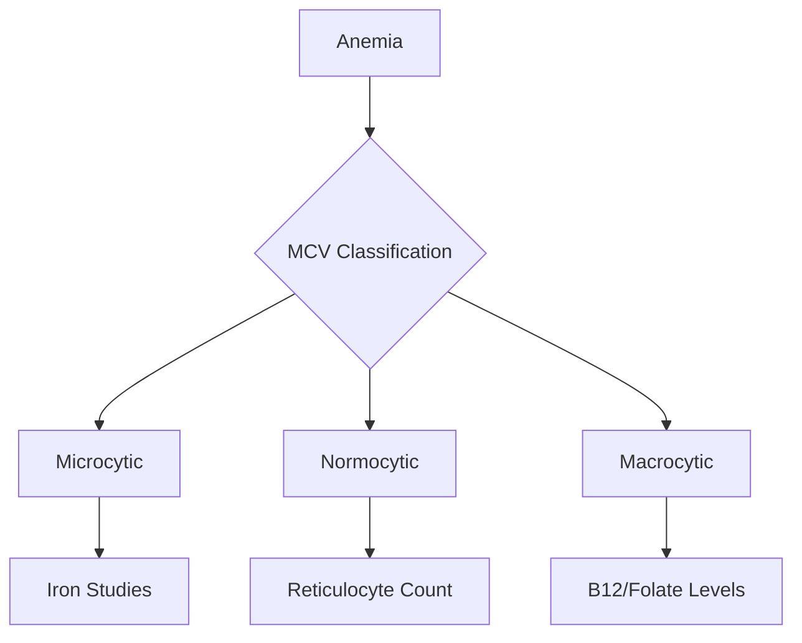

# Anemia: A Comprehensive Medical Knowledge Base

## Introduction and Overview

<definition>Anemia is a medical condition characterized by a decrease in the total red blood cell count, hemoglobin concentration, or hematocrit, leading to a reduced capacity of blood to carry oxygen to tissues.</definition>

### Historical Context

The understanding of anemia has evolved significantly since its first scientific descriptions in the 17th century. Key historical milestones include:

- 1713: Antony van Leeuwenhoek's first microscopic description of red blood cells
- 1889: Emil Theodor Kocher's discovery of the relationship between iron and anemia
- 1926: George Minot and William Murphy's breakthrough in pernicious anemia treatment
- 1956: Vernon Ingram's identification of the molecular basis of sickle cell anemia

### Global Impact

Anemia affects approximately 1.62 billion people globally, representing 24.8% of the world's population. The condition poses significant public health challenges:

- Reduced work productivity
- Impaired cognitive development in children
- Increased maternal and infant mortality
- Substantial healthcare costs
- Economic burden on healthcare systems

## Pathophysiology

### Normal Erythropoiesis

<theory>Red blood cell production (erythropoiesis) occurs in the bone marrow through a complex process regulated by multiple factors:</theory>

1. Stem Cell Differentiation
   - Pluripotent stem cells
   - Committed erythroid progenitors
   - Mature erythrocytes

2. Regulatory Factors
   - Erythropoietin (EPO)
   - Iron availability
   - Vitamin B12 and folate
   - Heme synthesis

### Mechanisms of Anemia Development

Anemia can develop through three primary mechanisms:

1. Decreased Production
   - Bone marrow failure
   - Nutritional deficiencies
   - Chronic diseases

2. Increased Destruction
   - Hemolytic conditions
   - Autoimmune disorders
   - Genetic abnormalities

3. Blood Loss
   - Acute hemorrhage
   - Chronic bleeding
   - Occult blood loss

## Classification and Types

### Morphological Classification

Based on Mean Corpuscular Volume (MCV):

1. Microcytic Anemia (MCV < 80 fL)
   - Iron deficiency anemia
   - Thalassemia
   - Anemia of chronic disease

2. Normocytic Anemia (MCV 80-100 fL)
   - Acute blood loss
   - Hemolytic anemia
   - Anemia of chronic disease

3. Macrocytic Anemia (MCV > 100 fL)
   - Vitamin B12 deficiency
   - Folate deficiency
   - Myelodysplastic syndromes

### Etiological Classification

<example>
Common causes of anemia include:

1. Nutritional Deficiencies
   - Iron deficiency (most common globally)
   - Vitamin B12 deficiency
   - Folate deficiency

2. Genetic Disorders
   - Thalassemia
   - Sickle cell disease
   - Hereditary spherocytosis

3. Acquired Conditions
   - Chronic kidney disease
   - Inflammatory conditions
   - Malignancies
</example>

## Etiology and Risk Factors

### Primary Etiological Factors

#### 1. Nutritional Deficiencies
- Iron Deficiency (ID)
  * Accounts for 50% of anemia cases globally
  * Prevalence: 30% in non-pregnant women, 42% in pregnant women
  * Primary causes:
    - Inadequate dietary intake
    - Malabsorption disorders
    - Increased physiological demands

- Vitamin B12 Deficiency
  * Affects 6% of adults under 60 and 20% over 60
  * Common in:
    - Strict vegetarians/vegans
    - Patients with pernicious anemia
    - Those with gastrointestinal disorders

- Folate Deficiency
  * Prevalence: 2-10% in developed countries
  * Risk increases during:
    - Pregnancy
    - Chronic alcoholism
    - Malabsorption syndromes

#### 2. Genetic Factors

<theory>Inherited disorders affecting hemoglobin synthesis or red blood cell structure contribute significantly to global anemia burden.</theory>

##### Hereditary Conditions:
1. Thalassemias
   - Alpha thalassemia: 5% carrier rate globally
   - Beta thalassemia: 1.5% of global population carries genes

2. Sickle Cell Disease
   - Affects 300-400 million people worldwide
   - Carrier frequency:
     * 10-40% in Africa
     * 2-10% in Mediterranean regions

3. Hereditary Spherocytosis
   - Prevalence: 1 in 2,000 in Northern Europeans
   - Autosomal dominant inheritance in 75% of cases

### Risk Factors

#### Demographic Factors

1. Age-Related Risk:
   - Children under 5: 47% anemia prevalence globally
   - Elderly (>65): 10-11% prevalence
   - Women of reproductive age: 29-38% prevalence

2. Geographic Distribution:
   - Southeast Asia: 53.8% prevalence
   - Africa: 42.6% prevalence
   - Eastern Mediterranean: 38.9% prevalence

#### Environmental and Lifestyle Factors

1. Socioeconomic Status:
   - Lower income correlates with:
     * Reduced access to nutrient-rich foods
     * Limited healthcare access
     * Higher infection rates

2. Dietary Patterns:
   - Plant-based diets: risk of iron and B12 deficiency
   - Western diets: often low in folate
   - Cultural food practices affecting nutrient absorption

3. Occupational Exposure:
   - Lead exposure: 5-10% risk increase
   - Benzene exposure: associated with aplastic anemia
   - Radiation exposure: bone marrow suppression risk

## Pathophysiology

### Disease Mechanisms

#### 1. Disrupted Erythropoiesis

<definition>Erythropoiesis disruption occurs through multiple pathways affecting red blood cell production, maturation, or survival.</definition>

1. Bone Marrow Dysfunction:
   - Decreased stem cell proliferation
   - Impaired differentiation
   - Altered maturation processes

2. Regulatory Hormone Imbalances:
   - Erythropoietin deficiency
   - Hepcidin dysregulation
   - Inflammatory cytokine effects

#### 2. Hemolysis Mechanisms

1. Intravascular Hemolysis:
   - Complement activation
   - Mechanical trauma
   - Oxidative stress

2. Extravascular Hemolysis:
   - Splenic sequestration
   - Antibody-mediated destruction
   - Membrane defects

### Disease Progression

#### Acute Phase
1. Compensatory Mechanisms:
   - Increased erythropoietin production
   - Enhanced oxygen extraction
   - Cardiovascular adaptations

2. Early Manifestations:
   - Reduced oxygen delivery
   - Tissue hypoxia
   - Metabolic adaptations

#### Chronic Phase

1. Systemic Adaptations:
   - Cardiovascular remodeling
   - Altered metabolism
   - Tissue-specific responses

2. Complications Development:
   - Organ dysfunction
   - Growth impairment in children
   - Cognitive effects

### Current Research Areas

1. Molecular Pathways:
   - Iron metabolism regulation
   - Erythropoiesis signaling
   - Genetic modifiers

2. Novel Therapeutic Targets:
   - Hepcidin antagonists
   - HIF pathway modulators
   - Gene therapy approaches

## Diagnostic Approaches

### Initial Assessment

#### Physical Examination
1. General Appearance
   - Pallor assessment
     * Conjunctival pallor (most reliable)
     * Palmar creases
     * Nail beds
   - Jaundice evaluation
   - Signs of chronic disease

2. Vital Signs
   - Tachycardia (compensatory mechanism)
   - Blood pressure changes
   - Respiratory rate alterations

#### Key Clinical Signs
```json
{
  "diagnostic_signs": {
    "severe_anemia": [
      "Conjunctival pallor",
      "Tachycardia >100 bpm",
      "Systolic ejection murmur",
      "Dyspnea on exertion"
    ],
    "specific_types": {
      "megaloblastic": "Glossitis, peripheral neuropathy",
      "hemolytic": "Splenomegaly, jaundice",
      "aplastic": "Petechiae, ecchymoses"
    }
  }
}
```

### Laboratory Investigations

#### First-Line Tests
1. Complete Blood Count (CBC)
   - Hemoglobin concentration
   - Hematocrit
   - Red blood cell indices
     * MCV (Mean Corpuscular Volume)
     * MCH (Mean Corpuscular Hemoglobin)
     * MCHC (Mean Corpuscular Hemoglobin Concentration)
   - Red cell distribution width (RDW)
   - Reticulocyte count

2. Peripheral Blood Smear
   - Morphological assessment
   - Cell size and shape evaluation
   - Inclusion bodies
   - White blood cell and platelet examination

#### Secondary Investigations

1. Iron Studies
   - Serum iron
   - Total iron-binding capacity (TIBC)
   - Ferritin
   - Transferrin saturation

2. Vitamin Assays
   - Vitamin B12 levels
   - Folate (serum and RBC)
   - Methylmalonic acid (MMA)
   - Homocysteine levels

3. Hemolysis Markers
   - Lactate dehydrogenase (LDH)
   - Haptoglobin
   - Indirect bilirubin
   - Direct antiglobulin test (DAT)

### Advanced Diagnostic Procedures

#### Bone Marrow Examination
<theory>Indicated in cases where peripheral blood findings are inconclusive or suggest primary bone marrow disorder.</theory>

1. Aspiration
   - Cellularity assessment
   - Maturation patterns
   - Storage iron evaluation
   - Cytogenetic studies

2. Biopsy
   - Architectural pattern
   - Fibrosis assessment
   - Infiltrative processes

#### Molecular and Genetic Testing

1. Hemoglobinopathy Studies
   - Hemoglobin electrophoresis
   - High-performance liquid chromatography (HPLC)
   - DNA analysis for specific mutations

2. Specialized Tests
   - Flow cytometry
   - Chromosome analysis
   - Next-generation sequencing

### Diagnostic Algorithms

#### Morphological Approach


#### Severity-Based Classification
- Mild: Hemoglobin 10-12 g/dL
- Moderate: Hemoglobin 7-9.9 g/dL
- Severe: Hemoglobin <7 g/dL

### Differential Diagnosis

1. Microcytic Anemia
   - Iron deficiency
   - Thalassemia
   - Anemia of chronic disease
   - Sideroblastic anemia

2. Normocytic Anemia
   - Acute blood loss
   - Hemolysis
   - Chronic kidney disease
   - Endocrine disorders

3. Macrocytic Anemia
   - Vitamin B12 deficiency
   - Folate deficiency
   - Myelodysplastic syndrome
   - Drug-induced

## Prevention and Screening

### Primary Prevention Strategies

#### Nutritional Interventions

1. Iron Supplementation Programs
   - Universal fortification
     * Cereals and grains: 20-60 mg/kg
     * Salt fortification: 1000 ppm
   - Targeted supplementation
     * Pregnant women: 30-60 mg/day
     * Adolescent girls: 30-60 mg/week
     * Children: 2 mg/kg/day

2. Dietary Modifications
   ```json
   {
     "dietary_recommendations": {
       "iron_rich_foods": [
         "Lean meats",
         "Fish",
         "Leafy greens",
         "Legumes"
       ],
       "absorption_enhancers": [
         "Vitamin C rich foods",
         "Animal protein sources"
       ],
       "absorption_inhibitors": [
         "Phytates",
         "Tannins",
         "Calcium supplements"
       ]
     }
   }
   ```

#### Public Health Measures

1. Environmental Interventions
   - Parasitic disease control
   - Water sanitation programs
   - Lead exposure reduction
   - Industrial safety regulations

2. Educational Programs
   - School-based nutrition education
   - Healthcare provider training
   - Community health worker programs
   - Public awareness campaigns

### Screening Guidelines

#### Population-Based Screening

1. High-Risk Groups
   - Pregnant women
     * First prenatal visit
     * 24-28 weeks gestation
     * Postpartum check
   - Infants and young children
     * 12 months of age
     * Annually until age 5
   - Adolescent females
     * Every 5 years from menarche
   - Elderly adults
     * Annual screening >65 years

2. Screening Methods
   - Hemoglobin/hematocrit measurement
   - Serum ferritin testing
   - Complete blood count
   - Risk assessment questionnaires

#### Targeted Screening Programs

1. Genetic Screening
   - Newborn screening for hemoglobinopathies
   - Family history assessment
   - Genetic counseling for at-risk populations

2. Occupational Screening
   - High-risk industries
   - Regular monitoring protocols
   - Workplace safety assessments

### Population-Level Interventions

#### National Programs

1. Food Fortification Initiatives
   - Mandatory fortification laws
   - Quality control measures
   - Monitoring and evaluation systems

2. Healthcare Policy
   - Universal health coverage
   - Access to preventive services
   - Insurance coverage for screening

#### Global Health Initiatives

1. WHO Guidelines Implementation
   - Global targets for anemia reduction
   - International cooperation
   - Resource allocation strategies

2. Sustainable Development Goals
   - Integration with nutrition programs
   - Gender equality initiatives
   - Poverty reduction strategies

## Special Populations

### Pediatric Considerations

#### Age-Specific Manifestations

1. Neonates (0-28 days)
   - Physiologic anemia
   - Hemolytic disease of newborn
   - Maternal-fetal hemorrhage

2. Infants and Toddlers
   - Iron-deficiency risk
   - Growth and development impacts
   - Cognitive effects

#### Management Approaches

1. Treatment Modifications
   - Weight-based dosing
   - Liquid formulations
   - Compliance strategies

2. Monitoring Parameters
   - Growth charts
   - Developmental milestones
   - School performance

### Geriatric Considerations

#### Age-Related Changes

1. Physiological Alterations
   - Reduced bone marrow reserve
   - Chronic inflammation effects
   - Medication interactions

2. Comorbidity Management
   - Multiple medication considerations
   - Fall risk assessment
   - Cognitive function monitoring

#### Special Considerations

1. Quality of Life Impact
   - Functional status assessment
   - Social support evaluation
   - Independence maintenance

2. Treatment Adaptations
   - Dosing modifications
   - Side effect monitoring
   - Drug interactions

### Pregnancy and Lactation

#### Gestational Changes

1. Physiological Adaptations
   - Plasma volume expansion
   - Iron requirements
   - Hemodilution effects

2. Trimester-Specific Care
   - First trimester screening
   - Second trimester monitoring
   - Third trimester preparation

## Emerging Research and Future Directions

### Current Research Frontiers

#### Molecular and Genetic Studies

1. Gene Therapy Developments
   - CRISPR-Cas9 Applications
     * Beta-thalassemia gene editing
     * Sickle cell disease modifications
     * Enhanced erythropoiesis regulation
   - Viral Vector Technologies
     * AAV-based delivery systems
     * Lentiviral modifications
     * Safety profile improvements

2. Novel Therapeutic Targets
   ```json
   {
     "research_areas": {
       "molecular_pathways": [
         "Hepcidin-ferroportin axis",
         "HIF-pathway modulators",
         "Erythropoietin receptor agonists"
       ],
       "clinical_applications": [
         "Small molecule inhibitors",
         "Monoclonal antibodies",
         "RNA therapeutics"
       ]
     }
   }
   ```

#### Active Clinical Trials

1. Phase III Studies
   - Luspatercept for beta-thalassemia
   - Novel iron chelation agents
   - Long-acting erythropoiesis stimulating agents

2. Early Phase Research
   - Anti-hepcidin antibodies
   - Oral iron absorption enhancers
   - Red cell membrane stabilizers

### Innovative Diagnostic Approaches

#### Advanced Technologies

1. Artificial Intelligence Applications
   - Automated blood smear analysis
   - Predictive analytics for treatment response
   - Risk stratification algorithms

2. Point-of-Care Testing
   - Microfluidic devices
   - Smartphone-based diagnostics
   - Rapid molecular testing

#### Biomarker Development

1. Novel Markers
   - Erythroid maturation indicators
   - Iron homeostasis markers
   - Inflammation mediators

2. Integration with Clinical Care
   - Real-time monitoring systems
   - Personalized medicine approaches
   - Treatment response prediction

## Patient Education and Counseling

### Educational Resources

#### Written Materials

1. Comprehensive Guides
   - Disease-specific information
   - Treatment options
   - Lifestyle modifications
   - Nutritional guidance

2. Digital Resources
   - Mobile applications
   - Interactive learning modules
   - Video tutorials
   - Online support groups

#### Communication Strategies

1. Health Literacy Considerations
   - Plain language usage
   - Visual aids and infographics
   - Teach-back method
   - Cultural adaptation

2. Motivational Interviewing Techniques
   - Open-ended questions
   - Affirmations
   - Reflective listening
   - Summary statements

### Shared Decision-Making

#### Implementation Framework

1. Information Exchange
   - Risk communication
   - Benefits discussion
   - Alternative options
   - Expected outcomes

2. Decision Support Tools
   - Patient decision aids
   - Value clarification exercises
   - Action planning worksheets

#### Cultural Competency

1. Cultural Assessment
   - Health beliefs evaluation
   - Traditional medicine practices
   - Family involvement preferences
   - Language considerations

2. Adaptation Strategies
   - Cultural brokers utilization
   - Traditional healing integration
   - Family-centered care
   - Community resource linkage

### Support Systems

#### Patient Resources

1. Support Groups
   - In-person meetings
   - Online communities
   - Peer mentoring programs
   - Family support networks

2. Educational Programs
   - Self-management training
   - Nutrition workshops
   - Exercise programs
   - Stress management

#### Healthcare Team Collaboration

1. Interdisciplinary Approach
   - Primary care coordination
   - Specialist communication
   - Allied health involvement
   - Social services integration

2. Follow-up Care
   - Monitoring schedules
   - Treatment adherence
   - Outcome assessment
   - Quality of life evaluation

## Healthcare Economics and Policy

### Economic Impact Analysis

#### Direct Healthcare Costs

1. Hospital-Related Expenses
   - Inpatient care: $8,000-15,000 per admission
   - Emergency department visits: $1,200-3,500 per visit
   - Outpatient management: $2,500-6,000 annually
   - Transfusion services: $1,500-2,500 per unit

2. Medication Costs
   ```json
   {
     "annual_treatment_costs": {
       "iron_supplementation": "$200-600",
       "erythropoiesis_stimulating_agents": "$8,000-12,000",
       "chelation_therapy": "$30,000-50,000",
       "specialized_treatments": "$50,000-150,000"
     }
   }
   ```

#### Indirect Economic Burden

1. Productivity Losses
   - Work absenteeism: 12-15 days annually
   - Reduced work capacity: 20-30% productivity decline
   - Early retirement: 5-8 years premature exit
   - Caregiver burden: $15,000-25,000 annually

2. Societal Impact
   - Educational attainment reduction
   - Decreased workforce participation
   - Increased disability claims
   - Reduced national productivity

### Healthcare Policy Framework

#### Insurance Coverage

1. Public Insurance Programs
   - Medicare coverage
     * Part B: Outpatient services
     * Part D: Prescription drugs
     * Coverage gaps and supplements
   - Medicaid provisions
     * State-specific variations
     * Essential health benefits
     * Prior authorization requirements

2. Private Insurance Considerations
   - Coverage limitations
   - Prior authorization processes
   - Step therapy requirements
   - Out-of-pocket maximums

#### Regulatory Environment

1. FDA Guidelines
   - Treatment approval pathways
   - Safety monitoring requirements
   - Clinical trial regulations
   - Orphan drug designations

2. Quality Measures
   - HEDIS metrics
   - Quality reporting requirements
   - Performance benchmarks
   - Value-based care initiatives

## Interdisciplinary Care and Collaboration

### Healthcare Team Composition

#### Core Team Members

1. Primary Care Providers
   - Initial assessment
   - Care coordination
   - Ongoing monitoring
   - Prevention strategies

2. Specialists
   - Hematologists
   - Gastroenterologists
   - Nephrologists
   - Obstetric specialists

3. Allied Health Professionals
   - Clinical nurse specialists
   - Nutritionists/Dietitians
   - Social workers
   - Physical therapists

#### Support Services

1. Laboratory Services
   - Phlebotomists
   - Laboratory technicians
   - Pathologists
   - Blood bank personnel

2. Ancillary Services
   - Pharmacy services
   - Imaging departments
   - Transfusion services
   - Case management

### Care Coordination Models

#### Integrated Care Approaches

1. Patient-Centered Medical Home
   - Care team leadership
   - Communication protocols
   - Resource allocation
   - Outcome tracking

2. Specialty Care Integration
   ```json
   {
     "coordination_elements": {
       "care_planning": [
         "Treatment goals",
         "Monitoring schedules",
         "Emergency protocols",
         "Follow-up arrangements"
       ],
       "communication_channels": [
         "Electronic health records",
         "Secure messaging systems",
         "Team conferences",
         "Patient portals"
       ]
     }
   }
   ```

#### Transition of Care

1. Care Transitions
   - Hospital to home
   - Primary to specialty care
   - Pediatric to adult services
   - Emergency to routine care

2. Communication Protocols
   - Standardized handoffs
   - Documentation requirements
   - Information transfer
   - Follow-up verification

### Quality Improvement Initiatives

#### Performance Metrics

1. Clinical Outcomes
   - Hemoglobin levels
   - Transfusion requirements
   - Complication rates
   - Hospital readmissions

2. Process Measures
   - Appointment adherence
   - Medication compliance
   - Screening rates
   - Patient satisfaction

#### Continuous Improvement

1. Quality Assessment
   - Regular audits
   - Outcome analysis
   - Patient feedback
   - Team performance reviews

2. Implementation Strategies
   - Evidence-based protocols
   - Best practice guidelines
   - Staff education
   - Process optimization

## Technology and Innovation

### Digital Health Technologies

#### Diagnostic Technologies

1. Advanced Imaging Systems
   - AI-Enhanced Microscopy
     * Digital morphology analysis
     * Automated cell counting
     * Pattern recognition algorithms
     * Real-time classification
   - Spectroscopic Analysis
     * Hemoglobin measurement
     * Iron content assessment
     * Molecular fingerprinting

2. Point-of-Care Diagnostics
   ```json
   {
     "innovative_technologies": {
       "microfluidic_devices": [
         "Lab-on-chip platforms",
         "Rapid hemoglobin testing",
         "Cellular analysis systems"
       ],
       "wearable_sensors": [
         "Continuous hemoglobin monitoring",
         "Oxygen saturation tracking",
         "Activity level assessment"
       ]
     }
   }
   ```

#### Artificial Intelligence Applications

1. Machine Learning Models
   - Diagnostic Support
     * Blood smear analysis
     * Disease classification
     * Risk stratification
   - Treatment Optimization
     * Dose prediction
     * Response monitoring
     * Adverse event prediction

2. Clinical Decision Support Systems
   - Treatment Guidelines Integration
   - Drug Interaction Checking
   - Patient-Specific Recommendations
   - Outcome Prediction Models

### Telemedicine Solutions

#### Remote Monitoring Systems

1. Patient Monitoring Platforms
   - Vital Signs Tracking
   - Symptom Recording
   - Medication Adherence
   - Activity Monitoring

2. Data Integration Systems
   - Electronic Health Records
   - Laboratory Results
   - Imaging Studies
   - Patient-Reported Outcomes

#### Virtual Care Delivery

1. Telehealth Consultations
   - Initial Assessment
   - Follow-up Care
   - Medication Management
   - Patient Education

2. Mobile Health Applications
   - Symptom Tracking
   - Medication Reminders
   - Dietary Monitoring
   - Exercise Planning

## Global Health Perspectives

### Geographic Distribution

#### Regional Prevalence

1. High-Burden Regions
   - Sub-Saharan Africa: 67.6% in children
   - South Asia: 58.4% in pregnant women
   - Southeast Asia: 45.7% general population
   - Middle East: 38.9% women of reproductive age

2. Epidemiological Patterns
   ```json
   {
     "regional_variations": {
       "nutritional_deficiency": {
         "developing_countries": "60-70%",
         "developed_countries": "10-20%"
       },
       "genetic_disorders": {
         "mediterranean": "high thalassemia",
         "africa": "high sickle cell",
         "southeast_asia": "high hemoglobinopathy"
       }
     }
   }
   ```

### Cultural Considerations

#### Traditional Medicine Practices

1. Indigenous Healing Systems
   - Traditional Chinese Medicine
   - Ayurvedic Medicine
   - African Traditional Medicine
   - Native American Practices

2. Cultural Beliefs
   - Dietary Practices
   - Blood-Related Taboos
   - Traditional Remedies
   - Healthcare-Seeking Behaviors

### International Collaboration

#### Global Health Initiatives

1. WHO Programs
   - Global Nutrition Targets
   - Micronutrient Supplementation
   - Food Fortification Programs
   - Health System Strengthening

2. Research Networks
   - International Clinical Trials
   - Data Sharing Platforms
   - Collaborative Research Projects
   - Capacity Building Programs

#### Health Equity Measures

1. Access Improvement Strategies
   - Universal Health Coverage
   - Mobile Health Clinics
   - Community Health Workers
   - Telemedicine Implementation

2. Resource Distribution
   - Medical Supply Chains
   - Healthcare Worker Training
   - Technology Transfer
   - Financial Aid Programs

### Sustainable Development Goals

1. SDG Integration
   - Goal 2: Zero Hunger
   - Goal 3: Good Health
   - Goal 5: Gender Equality
   - Goal 10: Reduced Inequalities

2. Implementation Strategies
   - National Policy Development
   - International Partnerships
   - Monitoring Systems
   - Impact Assessment

## References and Resources

### Clinical Practice Guidelines

#### Major International Guidelines

1. World Health Organization (WHO)
   - WHO Guidelines on the Management of Severe Anemia (2023)
   - Global Nutrition Targets 2025: Anemia Policy Brief
   - WHO Guideline on Use of Ferritin Concentrations
   - Guidelines for Management of Hemoglobinopathies

2. American Society of Hematology (ASH)
   ```json
   {
     "clinical_guidelines": {
       "iron_deficiency": "2021 Guidelines for Iron Deficiency Anemia",
       "sickle_cell": "2020 Guidelines for Sickle Cell Disease",
       "thalassemia": "2022 Guidelines for Transfusion-Dependent Thalassemia",
       "diagnostic_approach": "2023 Guidelines for Evaluation of Anemia"
     }
   }
   ```

#### National Guidelines

1. British Society for Haematology (BSH)
   - Guidelines for Management of Iron Deficiency in Pregnancy
   - Guidelines for Laboratory Diagnosis of Anemia
   - Red Cell Transfusion Guidelines
   - Management of B12 and Folate Deficiency

2. European Society for Medical Oncology (ESMO)
   - Clinical Practice Guidelines: Anemia in Cancer
   - Management of Chemotherapy-Induced Anemia
   - Supportive Care Guidelines

### Seminal Studies and Meta-Analyses

#### Landmark Clinical Trials

1. Iron Deficiency Research
   - IRON-CKD Trial (2019)
     * Impact: Established optimal iron replacement protocols
     * Citation: N Engl J Med 2019;380:447-58
   - FAIR-HF Study (2018)
     * Impact: Defined role of IV iron in heart failure
     * Citation: Eur Heart J 2018;39:2465-76

2. Novel Therapeutics
   - BELIEVE Trial (2020)
     * Impact: Luspatercept in beta-thalassemia
     * Citation: N Engl J Med 2020;382:1219-31
   - MEDALIST Trial (2019)
     * Impact: Treatment of MDS-associated anemia
     * Citation: N Engl J Med 2019;380:1317-26

### Medical Databases and Resources

#### Online Databases

1. Evidence-Based Medicine
   - Cochrane Database of Systematic Reviews
   - UpToDate Clinical Database
   - DynaMed Plus
   - BMJ Best Practice

2. Research Databases
   - PubMed Central
   - Web of Science
   - EMBASE
   - Scopus

#### Professional Society Resources

1. Educational Materials
   ```json
   {
     "society_resources": {
       "ASH": {
         "education_portal": "ASH Academy",
         "clinical_tools": "ASH Clinical Tools",
         "guidelines_app": "ASH Guidelines App"
       },
       "ISTH": {
         "learning_center": "ISTH Academy",
         "case_studies": "Clinical Cases Repository",
         "webinars": "Expert Webinar Series"
       }
     }
   }
   ```

### Continuing Medical Education

#### Accredited Programs

1. Online Learning Platforms
   - Medscape Education
     * CME/CE courses
     * Clinical updates
     * Expert perspectives
   - Cleveland Clinic Center for Continuing Education
     * Self-assessment programs
     * Board review materials
     * Clinical pathways

2. Professional Development
   - Annual Scientific Meetings
   - Workshops and Seminars
   - Skills Development Programs
   - Certificate Courses

#### Research Resources

1. Clinical Trial Registries
   - ClinicalTrials.gov
   - EU Clinical Trials Register
   - WHO International Clinical Trials Registry
   - ISRCTN Registry

2. Research Support Tools
   - Research Methodology Guidelines
   - Statistical Analysis Resources
   - Grant Writing Resources
   - Publication Guidelines

### Patient Education Materials

1. Reliable Online Resources
   - National Institutes of Health (NIH)
   - Centers for Disease Control and Prevention (CDC)
   - Patient Advocacy Organizations
   - Medical Society Patient Portals

2. Educational Tools
   - Patient Information Leaflets
   - Decision Aid Tools
   - Educational Videos
   - Mobile Health Applications