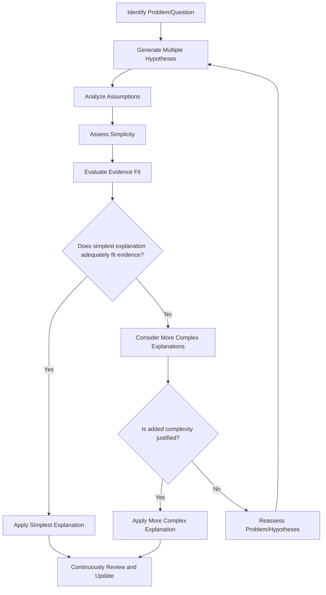

# Case Study Knowledge Base: Occam's Razor

Version 1.0 | Last Updated: 2023-06-14

## Table of Contents

1. [Introduction and Overview](#1-introduction-and-overview)
2. [Theoretical Framework](#2-theoretical-framework)
3. [Methodology for Case Study Analysis](#3-methodology-for-case-study-analysis)
4. [Case Study Collection](#4-case-study-collection)
5. [Cross-Case Analysis](#5-cross-case-analysis)
6. [Best Practices and Guidelines](#6-best-practices-and-guidelines)
7. [Ethical Considerations](#7-ethical-considerations)
8. [Future Trends and Emerging Applications](#8-future-trends-and-emerging-applications)
9. [Teaching and Learning Resources](#9-teaching-and-learning-resources)
10. [References and Further Reading](#10-references-and-further-reading)

## 1. Introduction and Overview

<principle_summary>
Occam's Razor, also known as the principle of parsimony, states that among competing hypotheses, the one with the fewest assumptions should be selected. In other words, the simplest explanation is usually the correct one.
</principle_summary>

<significance>
Occam's Razor has profound implications across various fields, including science, philosophy, medicine, and problem-solving in general. It serves as a guiding principle for researchers, decision-makers, and critical thinkers in their quest for truth and understanding.
</significance>

<scope>
This case study knowledge base explores the application of Occam's Razor in diverse contexts, from scientific discoveries to business strategies. It aims to provide a comprehensive understanding of how this principle influences decision-making processes and shapes our approach to complex problems.
</scope>

<importance_of_case_studies>
Case studies are crucial in understanding and applying Occam's Razor because they:
1. Demonstrate the principle in action across various real-world scenarios
2. Illustrate the benefits and potential limitations of applying the principle
3. Provide concrete examples that help learners internalize the concept
4. Offer insights into the nuances and complexities of applying Occam's Razor in different fields
</importance_of_case_studies>

## 2. Theoretical Framework

### 2.1 Core Concepts

<key_concept>
Simplicity: At its core, Occam's Razor favors simplicity over complexity. This doesn't mean that the simplest explanation is always correct, but rather that simplicity should be preferred when all other factors are equal.
</key_concept>

<key_concept>
Parsimony: The principle of parsimony suggests that we should avoid making unnecessary assumptions or multiplying entities beyond necessity.
</key_concept>

<key_concept>
Falsifiability: Occam's Razor is closely related to the concept of falsifiability in science. Simpler hypotheses are often easier to test and potentially falsify, making them more scientifically valuable.
</key_concept>

### 2.2 Historical Context

<historical_development>
- 14th Century: William of Ockham, a Franciscan friar and philosopher, formulated the principle, although similar ideas existed in ancient Greek philosophy.
- 16th-17th Centuries: The principle gained prominence during the Scientific Revolution, influencing thinkers like Galileo Galilei and Isaac Newton.
- 20th Century: Occam's Razor became a fundamental principle in the philosophy of science, championed by thinkers like Karl Popper and Bertrand Russell.
- Modern Era: The principle has found applications in fields as diverse as machine learning, medical diagnosis, and criminal investigation.
</historical_development>

### 2.3 Schools of Thought

1. Strict Interpretation: Advocates for always choosing the simplest explanation, regardless of other factors.
2. Probabilistic Approach: Views Occam's Razor as a heuristic that often leads to correct results but acknowledges exceptions.
3. Bayesian Interpretation: Incorporates Occam's Razor into Bayesian probability theory, formalizing the preference for simpler hypotheses.

### 2.4 Key Terminology

<terminology>
- Parsimony: Economy or frugality in the use of assumptions or explanations.
- Ontological Reduction: The practice of reducing the number of entities, concepts, or principles used to explain a phenomenon.
- Overfitting: In statistics and machine learning, the production of an analysis that corresponds too closely to a particular set of data, potentially failing to fit additional data or predict future observations reliably.
- Explanatory Power: The ability of a hypothesis or theory to effectively explain the phenomena it is meant to describe.
</terminology>

## 3. Methodology for Case Study Analysis

### 3.1 Selection Criteria

To ensure a comprehensive and balanced exploration of Occam's Razor, case studies were selected based on the following criteria:

1. Relevance: Clear demonstration of Occam's Razor in action
2. Diversity: Representation of various fields and contexts
3. Impact: Significant consequences or insights resulting from the application of the principle
4. Verifiability: Well-documented cases with reliable sources
5. Complexity: A mix of straightforward and nuanced applications of the principle

### 3.2 Analysis Framework

Each case study will be analyzed using the following framework:

1. Context Analysis: Understanding the background and setting of the case
2. Problem Identification: Clearly stating the challenge or question at hand
3. Competing Hypotheses: Outlining the various explanations or solutions proposed
4. Application of Occam's Razor: Examining how the principle was applied
5. Outcome Evaluation: Assessing the results of applying Occam's Razor
6. Critical Reflection: Considering the strengths and limitations of the approach

### 3.3 Comparative Analysis

To extract broader insights, we will employ the following methods for cross-case comparison:

1. Thematic Analysis: Identifying common themes and patterns across cases
2. Contextual Comparison: Examining how different contexts influence the application of Occam's Razor
3. Outcome Mapping: Comparing the effectiveness of applying the principle across various scenarios
4. Limitation Identification: Recognizing common challenges or shortcomings in applying Occam's Razor

## 4. Case Study Collection

### 4.1 Scientific Discovery: The Copernican Revolution

<case_study id="CS001">
<title>Simplifying the Cosmos: Copernicus and Heliocentrism</title>

<context>
In the 16th century, the prevailing model of the universe was the Ptolemaic system, which placed Earth at the center of the cosmos. This geocentric model required complex explanations to account for the observed movements of celestial bodies.
</context>

<stakeholders>
- Nicolaus Copernicus: Polish astronomer and mathematician
- The Catholic Church: Upholder of the traditional geocentric view
- Scientific community of the 16th century
</stakeholders>

<challenge>
Explain the observed movements of planets and stars in a simpler, more elegant manner than the complex Ptolemaic system.
</challenge>

<principle_application>
Copernicus proposed a heliocentric model, placing the Sun at the center of the solar system. This simpler explanation required fewer assumptions and complex calculations to explain planetary motions.
</principle_application>

<outcome>
While initially controversial, the Copernican model eventually gained acceptance due to its simplicity and predictive power. It laid the foundation for modern astronomy and our understanding of the cosmos.
</outcome>

<analysis>
The Copernican Revolution exemplifies Occam's Razor by demonstrating how a simpler explanation (heliocentrism) can supplant a more complex one (geocentrism) when it better accounts for observed phenomena with fewer assumptions.
</analysis>

<lessons_learned>
1. Simplicity can lead to profound scientific breakthroughs.
2. Established complex theories may be vulnerable to simpler, more elegant explanations.
3. The application of Occam's Razor can challenge deeply held beliefs and transform entire fields of study.
</lessons_learned>
</case_study>

### 4.2 Medical Diagnosis: Dr. Theodore Woodward and "Zebra" Diagnoses

<case_study id="CS002">
<title>When You Hear Hoofbeats, Think Horses, Not Zebras</title>

<context>
In the field of medical diagnosis, physicians often encounter patients with complex symptoms that could potentially be attributed to various causes, from common illnesses to rare diseases.
</context>

<stakeholders>
- Dr. Theodore Woodward: Professor at the University of Maryland School of Medicine
- Medical students and practicing physicians
- Patients seeking accurate diagnoses
</stakeholders>

<challenge>
Develop an efficient approach to medical diagnosis that prioritizes likely explanations without overlooking rare conditions.
</challenge>

<principle_application>
Dr. Woodward coined the aphorism, "When you hear hoofbeats, think of horses, not zebras," encouraging doctors to consider common diagnoses before rare ones. This application of Occam's Razor in medicine promotes efficient and accurate diagnoses.
</principle_application>

<outcome>
The "horses, not zebras" principle has become a widely adopted heuristic in medical education and practice, improving diagnostic efficiency and reducing unnecessary tests and treatments.
</outcome>

<analysis>
This case demonstrates how Occam's Razor can be applied in a high-stakes field like medicine. By prioritizing simpler, more common explanations, doctors can efficiently diagnose and treat patients while still remaining open to the possibility of rare conditions when evidence warrants.
</analysis>

<lessons_learned>
1. Occam's Razor can be a valuable tool in time-sensitive decision-making processes.
2. Balancing simplicity with thoroughness is crucial in fields where overlooking rare cases can have serious consequences.
3. Heuristics based on Occam's Razor can be effectively taught and applied in professional education.
</lessons_learned>
</case_study>

### 4.3 Criminal Investigation: The Principle of Parsimony in Forensics

<case_study id="CS003">
<title>Solving the Green River Killer Case: Simplicity in Serial Killer Profiling</title>

<context>
The Green River Killer case was one of the most prolific serial killer investigations in U.S. history, spanning over two decades from the 1980s to the early 2000s.
</context>

<stakeholders>
- Law enforcement agencies, including the Green River Task Force
- Victims and their families
- Gary Leon Ridgway (the Green River Killer)
- Criminal profilers and forensic experts
</stakeholders>

<challenge>
Identify and apprehend a serial killer responsible for numerous murders in the Seattle area, with limited physical evidence and a wide range of potential suspects.
</challenge>

<principle_application>
Investigators applied Occam's Razor by focusing on the simplest explanation for the crimes: a local individual with a consistent modus operandi, rather than multiple killers or elaborate conspiracy theories.
</principle_application>

<outcome>
The application of this principle, combined with advances in DNA technology, eventually led to the arrest and conviction of Gary Leon Ridgway in 2001.
</outcome>

<analysis>
By prioritizing simpler explanations and profiles, investigators were able to narrow their focus and allocate resources more effectively. This case demonstrates how Occam's Razor can be applied in complex, long-term investigations to guide decision-making and resource allocation.
</analysis>

<lessons_learned>
1. In complex investigations, focusing on simpler explanations can help maintain focus and efficiency.
2. Occam's Razor can be effectively combined with technological advancements to solve long-standing cases.
3. The principle of parsimony in criminal profiling must be balanced with thorough investigation of all credible leads.
</lessons_learned>
</case_study>

### 4.4 Business Strategy: Amazon's Customer-Centric Approach

<case_study id="CS004">
<title>Amazon's "Customer Obsession": Simplifying Business Strategy</title>

<context>
In the highly competitive e-commerce and technology sectors, companies often struggle with complex strategies to gain market share and drive growth.
</context>

<stakeholders>
- Jeff Bezos, founder of Amazon
- Amazon's leadership team and employees
- Customers
- Competitors in e-commerce and tech industries
</stakeholders>

<challenge>
Develop a clear, focused strategy for long-term growth and success in a rapidly evolving market landscape.
</challenge>

<principle_application>
Amazon applied Occam's Razor by centering its entire business strategy around a single, simple principle: customer obsession. This approach simplified decision-making processes and prioritized initiatives that directly benefited customers.
</principle_application>

<outcome>
Amazon's customer-centric approach has led to consistent innovation, market leadership, and strong customer loyalty, contributing to the company's remarkable growth and diversification.
</outcome>

<analysis>
By simplifying its core strategy to focus primarily on customer needs, Amazon was able to make clearer decisions and allocate resources more effectively. This case illustrates how Occam's Razor can be applied to business strategy to create a unifying principle that guides an entire organization.
</analysis>

<lessons_learned>
1. A simple, focused strategy can be more effective than complex, multi-faceted approaches.
2. Occam's Razor in business can lead to clearer decision-making and more efficient resource allocation.
3. Simplicity in strategy can foster innovation and adaptability in rapidly changing markets.
</lessons_learned>
</case_study>

### 4.5 Artificial Intelligence: Applying Occam's Razor in Machine Learning

<case_study id="CS005">
<title>Preventing Overfitting: Occam's Razor in Neural Network Design</title>

<context>
In the field of machine learning, particularly in the design of neural networks, researchers and data scientists often grapple with the problem of overfitting, where models become too complex and fail to generalize well to new data.
</context>

<stakeholders>
- Machine learning researchers and practitioners
- Tech companies developing AI solutions
- End-users of AI-powered applications
</stakeholders>

<challenge>
Design neural networks that can accurately model complex relationships in data while avoiding overfitting and maintaining good generalization performance.
</challenge>

<principle_application>
Researchers apply Occam's Razor through techniques like regularization, pruning, and model selection criteria (e.g., Akaike Information Criterion) that penalize unnecessary complexity in neural network architectures.
</principle_application>

<outcome>
The application of these simplicity-favoring techniques has led to the development of more efficient and generalizable neural networks, improving performance across various AI applications.
</outcome>

<analysis>
This case demonstrates how Occam's Razor can be formalized and applied in highly technical fields like machine learning. By favoring simpler models, researchers can create AI systems that are not only more accurate but also more interpretable and computationally efficient.
</analysis>

<lessons_learned>
1. Simplicity in model design can lead to better generalization and robustness in AI systems.
2. Occam's Razor can be quantified and incorporated into algorithmic decision-making processes.
3. Balancing model complexity with performance is crucial in developing practical AI solutions.
</lessons_learned>
</case_study>

### 4.6 Environmental Science: The Ozone Hole Mystery

<case_study id="CS006">
<title>Unraveling the Ozone Depletion Puzzle: A Triumph of Simplicity</title>

<context>
In the 1980s, scientists discovered a significant depletion of the ozone layer over Antarctica, leading to intense research and debate about its causes.
</context>

<stakeholders>
- Atmospheric scientists and researchers
- Environmental protection agencies
- Chemical manufacturers
- Global population affected by increased UV radiation
</stakeholders>

<challenge>
Identify the cause of ozone depletion and propose effective solutions to address the problem.
</challenge>

<principle_application>
Researchers applied Occam's Razor by focusing on the simplest explanation: the role of chlorofluorocarbons (CFCs) in catalyzing ozone breakdown, rather than more complex theories involving natural phenomena or multiple interacting factors.
</principle_application>

<outcome>
The identification of CFCs as the primary cause led to the Montreal Protocol, an international treaty designed to protect the ozone layer by phasing out the production of ozone-depleting substances.
</outcome>

<analysis>
By prioritizing the simplest explanation that fit the observed data, scientists were able to quickly identify the cause of ozone depletion and propose effective solutions. This case illustrates how Occam's Razor can be applied in environmental science to address global challenges.
</analysis>

<lessons_learned>
1. In complex environmental systems, focusing on the simplest explanation can lead to faster problem-solving.
2. Occam's Razor can guide research priorities in addressing global environmental challenges.
3. Simple, clear explanations can be powerful in driving policy changes and international cooperation.
</lessons_learned>
</case_study>

### 4.7 Psychology: Cognitive Behavioral Therapy and Occam's Razor

<case_study id="CS007">
<title>Simplifying Mental Health Treatment: The CBT Revolution</title>

<context>
In the field of psychotherapy, practitioners have long debated the most effective approaches to treating mental health disorders, with some favoring complex, long-term treatments based on uncovering unconscious conflicts.
</context>

<stakeholders>
- Mental health professionals
- Patients seeking treatment for mental health issues
- Health insurance companies
- Researchers in psychology and psychiatry
</stakeholders>

<challenge>
Develop an effective, evidence-based approach to treating common mental health disorders that can be widely implemented and produce measurable results.
</challenge>

<principle_application>
Cognitive Behavioral Therapy (CBT) applies Occam's Razor by focusing on the simplest explanation for psychological distress: the interaction between thoughts, feelings, and behaviors. This approach eschews complex theories of unconscious conflicts in favor of addressing observable cognitive and behavioral patterns.
</principle_application>

<outcome>
CBT has become one of the most widely practiced and researched forms of psychotherapy, demonstrating effectiveness for a range of mental health issues and contributing to the development of other evidence-based treatments.
</outcome>

<analysis>
The success of CBT illustrates how applying Occam's Razor in psychology can lead to more practical, effective, and widely applicable treatments. By focusing on simpler explanations and interventions, CBT has made mental health treatment more accessible and measurable.
</analysis>

<lessons_learned>
1. Simplicity in therapeutic approaches can lead to more widely applicable and effective treatments.
2. Occam's Razor can guide the development of evidence-based practices in mental health.
3. Focusing on observable, measurable factors can improve the efficacy and accessibility of psychological interventions.
</lessons_learned>
</case_study>

### 4.8 Astrophysics: Dark Matter and the Missing Mass Problem

<case_study id="CS008">
<title>The Dark Matter Hypothesis: When Simplicity Leads to Mystery</title>

<context>
In the 1930s, astronomers observed that the rotational speeds of galaxies couldn't be explained by the visible matter alone, leading to the "missing mass" problem.
</context>

<stakeholders>
- Astrophysicists and cosmologists
- Observational astronomers
- Particle physicists
- Space agencies and research institutions
</stakeholders>

<challenge>
Explain the observed rotational speeds of galaxies and other large-scale structures in the universe that seem to contradict the predictions based on visible matter alone.
</challenge>

<principle_application>
Scientists applied Occam's Razor by proposing the existence of dark matter – an invisible, non-interacting form of matter – as the simplest explanation for the observed gravitational effects, rather than modifying the fundamental laws of gravity or proposing more complex scenarios.
</principle_application>

<outcome>
The dark matter hypothesis has become a cornerstone of modern cosmology, driving research in both astrophysics and particle physics, despite the fact that dark matter particles have not yet been directly detected.
</outcome>

<analysis>
This case presents an interesting application of Occam's Razor where the simplest explanation (dark matter) leads to a profound mystery. It demonstrates how the principle can guide scientific inquiry even when it leads to counterintuitive or currently unverifiable conclusions.
</analysis>

<lessons_learned>
1. The simplest explanation may sometimes involve proposing new entities or phenomena.
2. Occam's Razor can guide scientific inquiry into realms beyond current observational capabilities.
3. The principle of simplicity must be balanced with the need for empirical verification in scientific theories.
</lessons_learned>
</case_study>

## 5. Cross-Case Analysis

### 5.1 Common Themes and Patterns

1. Simplification of Complex Problems
   - Across various fields, from astronomy to psychology, applying Occam's Razor often involves distilling complex issues into simpler, more manageable components.
   - This simplification frequently leads to more effective problem-solving and clearer communication of ideas.

2. Challenging Established Paradigms
   - In several cases (e.g., Copernican Revolution, CBT), the application of Occam's Razor led to paradigm shifts that challenged long-held beliefs or practices.
   - Simpler explanations often face initial resistance but can ultimately lead to significant advancements in understanding and practice.

3. Balancing Simplicity and Comprehensiveness
   - While favoring simpler explanations, most cases also demonstrate the need to balance simplicity with thoroughness and attention to detail.
   - This balance is particularly evident in fields like medicine and criminal investigation, where overlooking rare cases can have serious consequences.

4. Guiding Research and Innovation
   - Occam's Razor frequently serves as a guiding principle in research, helping to prioritize hypotheses and allocate resources more effectively.
   - In fields like AI and environmental science, the principle has driven innovation by encouraging researchers to seek elegant, generalizable solutions.

### 5.2 Contextual Variations

1. Scientific vs. Practical Applications
   - In pure scientific contexts (e.g., astrophysics), Occam's Razor often leads to theoretical simplifications that may not be immediately practical or verifiable.
   - In applied fields (e.g., business strategy, psychotherapy), the principle tends to produce more immediately actionable and testable outcomes.

2. Short-term vs. Long-term Implications
   - Some applications of Occam's Razor yield immediate results (e.g., medical diagnosis), while others have long-term, far-reaching consequences (e.g., environmental policy based on ozone depletion research).
   - The time scale of outcomes can influence how strictly the principle is applied in different contexts.

3. Individual vs. Systemic Applications
   - In some cases (e.g., medical diagnosis, criminal profiling), Occam's Razor is applied to individual instances or cases.
   - In others (e.g., business strategy, scientific theories), it shapes entire systems of thought or organizational approaches.

### 5.3 Effectiveness Analysis

1. Problem-Solving Efficiency
   - Across most cases, applying Occam's Razor led to more efficient problem-solving by focusing efforts on the most likely or manageable explanations.
   - This efficiency was particularly evident in time-sensitive contexts like medical diagnosis and criminal investigation.

2. Predictive Power
   - Simpler explanations often demonstrated superior predictive power, as seen in the Copernican model of the solar system and the success of CBT in treating mental health disorders.
   - However, the case of dark matter shows that sometimes the simplest explanation may lead to predictions that are challenging to verify.

3. Adaptability and Scalability
   - Simpler models and strategies (e.g., Amazon's customer-centric approach, regularization in machine learning) often proved more adaptable to changing circumstances and scalable across different contexts.

4. Communication and Adoption
   - Simpler explanations and strategies were generally easier to communicate and more readily adopted, as demonstrated by the widespread acceptance of the "horses not zebras" principle in medicine.

### 5.4 Limitations and Challenges

1. Risk of Oversimplification
   - In some cases, strict adherence to Occam's Razor might lead to overlooking important complexities or rare but significant factors.
   - This risk is particularly relevant in fields like medicine and environmental science, where multiple factors often interact in complex ways.

2. Subjectivity in Defining Simplicity
   - What constitutes the "simplest" explanation can sometimes be subjective or context-dependent, as seen in debates over competing scientific theories.

3. Balancing Simplicity with Accuracy
   - In fields like machine learning, there's an ongoing challenge to balance the simplicity of models with their accuracy and generalizability.
   - This balance often requires sophisticated techniques and careful judgment.

4. Cultural and Disciplinary Biases
   - The application of Occam's Razor can be influenced by cultural or disciplinary biases, potentially leading to blind spots or resistance to novel but complex explanations.

## 6. Best Practices and Guidelines

### 6.1 Framework for Applying Occam's Razor

1. Problem Definition
   - Clearly articulate the problem or question at hand.
   - Identify all relevant factors and potential explanations.

2. Hypothesis Generation
   - Develop multiple hypotheses that could explain the observed phenomena.
   - Ensure a range of explanations from simple to complex are considered.

3. Assumption Analysis
   - For each hypothesis, list out all underlying assumptions.
   - Evaluate the necessity and reasonableness of each assumption.

4. Simplicity Assessment
   - Compare the hypotheses based on the number and complexity of assumptions.
   - Consider which explanation requires the fewest new assumptions or entities.

5. Evidence Evaluation
   - Assess how well each hypothesis fits the available evidence.
   - Consider predictive power and explanatory scope.

6. Balancing Act
   - Weigh the simplicity of each explanation against its ability to account for all observed phenomena.
   - Consider potential consequences of choosing a simpler explanation over a more complex one.

7. Decision and Application
   - Select the simplest explanation that adequately accounts for the evidence.
   - Apply the chosen explanation while remaining open to new evidence or alternative interpretations.

8. Continuous Review
   - Regularly reassess the chosen explanation as new data becomes available.
   - Be prepared to revise or replace the explanation if simpler or more comprehensive alternatives emerge.

### 6.2 Decision-Making Flowchart

### 6.3 Potential Pitfalls and How to Avoid Them

1. Oversimplification
   - Pitfall: Choosing an explanation that is too simple to account for all observed phenomena.
   - Avoidance: Regularly check if the chosen explanation can predict and explain new observations. Be open to adding complexity when justified by evidence.

2. Ignoring Context
   - Pitfall: Applying Occam's Razor without considering the specific context or domain knowledge.
   - Avoidance: Always incorporate relevant background information and expert knowledge when evaluating explanations.

3. Confirmation Bias
   - Pitfall: Favoring simpler explanations that confirm pre-existing beliefs or preferences.
   - Avoidance: Actively seek out and consider alternative explanations, especially those that challenge your initial assumptions.

4. Neglecting Rare Events
   - Pitfall: Overlooking low-probability but high-impact events or explanations.
   - Avoidance: Include a step in your analysis to consider potential "black swan" events or explanations, especially in high-stakes situations.

5. Misinterpreting "Simplest"
   - Pitfall: Equating "simplest" with "easiest to understand" rather than "requiring the fewest assumptions."
   - Avoidance: Focus on the number and nature of assumptions required by each explanation, not just on surface-level simplicity.

6. Premature Application
   - Pitfall: Applying Occam's Razor too early in the problem-solving process, before gathering sufficient evidence.
   - Avoidance: Ensure a thorough evidence-gathering phase before comparing hypotheses. Be willing to delay judgment if more data is needed.

7. Rigidity
   - Pitfall: Becoming too attached to a simple explanation and resisting new evidence that suggests greater complexity.
   - Avoidance: Cultivate intellectual humility and maintain a mindset of continuous learning and adaptation.

### 6.4 Integrating Occam's Razor with Other Thinking Tools

1. Combine with Systems Thinking
   - Use Occam's Razor to simplify individual components within a larger system.
   - Apply systems thinking to understand how these simplified components interact.

2. Pair with Bayesian Reasoning
   - Use Bayesian probability to quantify the likelihood of different explanations.
   - Apply Occam's Razor as a prior probability, favoring simpler explanations in the absence of strong evidence for complexity.

3. Incorporate Critical Thinking Frameworks
   - Use tools like the CRAAP test (Currency, Relevance, Authority, Accuracy, Purpose) to evaluate the quality of evidence before applying Occam's Razor.
   - Apply logical fallacy checks to ensure that the pursuit of simplicity doesn't lead to flawed reasoning.

4. Combine with Scenario Planning
   - Use Occam's Razor to develop a base case scenario.
   - Develop alternative scenarios that incorporate greater complexity to test the robustness of the simpler explanation.

5. Integrate with Design Thinking
   - Apply Occam's Razor during the ideation phase to generate simple, elegant solutions.
   - Use design thinking principles to test and iterate on these simple solutions in real-world contexts.

6. Pair with Decision Trees
   - Use decision trees to map out the logical flow of different explanations or solutions.
   - Apply Occam's Razor to prune unnecessary branches and simplify the decision-making process.

By integrating Occam's Razor with these and other thinking tools, decision-makers can develop a more nuanced and effective approach to problem-solving across various domains.

## 7. Ethical Considerations

### 7.1 Ethical Implications of Applying Occam's Razor

1. Reductionism vs. Holism
   - Ethical Concern: Overreliance on Occam's Razor may lead to reductionist thinking, potentially overlooking important complexities in ethical decision-making.
   - Consideration: Balance the pursuit of simplicity with a holistic understanding of ethical issues, especially in complex social or environmental contexts.

2. Fairness and Equality
   - Ethical Concern: Simpler explanations might inadvertently favor dominant perspectives or overlook minority experiences.
   - Consideration: Actively seek diverse viewpoints and consider the ethical implications of choosing simpler explanations in matters of social justice and equality.

3. Responsibility and Accountability
   - Ethical Concern: Simplifying complex systems might obscure lines of responsibility or accountability.
   - Consideration: Ensure that the application of Occam's Razor doesn't lead to oversimplification of ethical responsibilities, especially in corporate or governmental contexts.

4. Transparency and Explainability
   - Ethical Concern: In fields like AI and machine learning, simpler models might be more explainable but potentially less accurate.
   - Consideration: Balance the ethical imperative for transparency with the need for accuracy and effectiveness, especially in high-stakes decision-making systems.

5. Long-term Consequences
   - Ethical Concern: Favoring simpler explanations or solutions might neglect long-term, complex consequences.
   - Consideration: Incorporate long-term thinking and scenario planning when applying Occam's Razor to ethical decision-making.

### 7.2 Navigating Ethical Dilemmas

1. Ethical Framework Integration
   - Incorporate established ethical frameworks (e.g., utilitarianism, deontology, virtue ethics) when applying Occam's Razor to ethical dilemmas.
   - Use these frameworks to evaluate the ethical implications of choosing simpler explanations or solutions.

2. Stakeholder Analysis
   - Conduct a thorough stakeholder analysis to understand the potential impacts of applying Occam's Razor on different groups.
   - Consider how simplification might affect vulnerable or underrepresented stakeholders.

3. Ethical Impact Assessment
   - Develop and apply an ethical impact assessment tool that evaluates the potential consequences of choosing simpler explanations or solutions.
   - Include both short-term and long-term ethical considerations in this assessment.

4. Ethical Review Boards
   - In high-stakes or sensitive areas, establish ethical review boards to evaluate the application of Occam's Razor.
   - Ensure these boards include diverse perspectives and expertise in both ethics and the relevant domain.

5. Transparency in Reasoning
   - Clearly communicate the rationale behind applying Occam's Razor in ethical decision-making.
   - Be transparent about the trade-offs and potential limitations of choosing simpler explanations or solutions.

### 7.3 Case Study: Ethical Application of Occam's Razor in Healthcare

<case_study id="CS009">
<title>Balancing Simplicity and Comprehensiveness in Medical Diagnosis</title>

<context>
A hospital is implementing a new diagnostic protocol for patients presenting with chest pain, aiming to balance efficient triage with comprehensive care.
</context>

<stakeholders>
- Emergency department physicians and staff
- Patients with varying risk profiles
- Hospital administration
- Health insurance providers
</stakeholders>

<challenge>
Develop a diagnostic approach that applies Occam's Razor to improve efficiency without compromising patient safety or overlooking less common but serious conditions.
</challenge>

<principle_application>
The hospital applies Occam's Razor by developing a tiered diagnostic protocol:

The hospital applies Occam's Razor by developing a tiered diagnostic protocol:
1. Initial assessment focuses on the most common and immediately life-threatening causes of chest pain (e.g., acute coronary syndrome, pulmonary embolism).
2. If initial tests are negative, a second tier of assessments considers less common but still serious conditions.
3. For patients with persistent symptoms or risk factors, a more comprehensive evaluation is conducted.

This approach aims to balance efficiency with thoroughness, applying the principle of parsimony while maintaining patient safety.
</principle_application>

<outcome>
The new protocol leads to faster triage and treatment for common conditions, reducing overall wait times and improving patient satisfaction. However, there are a few cases where less common conditions are initially overlooked, leading to delayed diagnosis in a small number of patients.
</outcome>

<analysis>
This case illustrates the ethical challenges of applying Occam's Razor in healthcare. While the simplified protocol improves efficiency and outcomes for the majority of patients, it raises ethical concerns about the potential for missed diagnoses and the balance between population-level benefits and individual patient care.
</analysis>

<lessons_learned>
1. Ethical application of Occam's Razor in healthcare requires careful balance between efficiency and comprehensiveness.
2. Regular review and adjustment of simplified protocols are necessary to address emerging ethical concerns.
3. Clear communication with patients about the diagnostic process and its limitations is crucial for maintaining trust and informed consent.
4. Incorporating safety nets and follow-up procedures can help mitigate the risks associated with simplified approaches.
</lessons_learned>
</case_study>

### 7.4 Ethical Guidelines for Applying Occam's Razor

1. Prioritize Human Welfare
   - Ensure that the pursuit of simplicity does not compromise human well-being, safety, or dignity.
   - When simplification might impact vulnerable populations, err on the side of caution and comprehensiveness.

2. Maintain Intellectual Honesty
   - Be transparent about the limitations and potential biases of simplified explanations or solutions.
   - Acknowledge when more complex explanations might be necessary, even if they are less convenient or intuitive.

3. Foster Inclusivity
   - Actively seek diverse perspectives when applying Occam's Razor, especially in social or cultural contexts.
   - Be aware of how simplification might reinforce existing biases or power structures.

4. Balance Short-term and Long-term Consequences
   - Consider both immediate outcomes and long-term implications when choosing simpler explanations or solutions.
   - Implement monitoring systems to track the ethical impacts of simplified approaches over time.

5. Uphold Professional Standards
   - Ensure that the application of Occam's Razor aligns with relevant professional codes of ethics and best practices.
   - When simplification conflicts with professional standards, prioritize ethical obligations over efficiency.

6. Respect Autonomy and Informed Consent
   - In contexts like healthcare or legal decisions, ensure that simplified explanations or processes do not undermine individuals' right to make informed choices.
   - Provide clear, accessible information about the benefits and potential drawbacks of simplified approaches.

7. Maintain Flexibility and Adaptability
   - Be willing to revise or abandon simplified explanations or solutions when new evidence or ethical concerns emerge.
   - Foster a culture of continuous learning and ethical reflection in the application of Occam's Razor.

8. Consider Systemic Impacts
   - Evaluate how the application of Occam's Razor in one area might affect interconnected systems or communities.
   - Be mindful of unintended consequences that might arise from oversimplification of complex social or environmental issues.

9. Protect Privacy and Data Ethics
   - When applying Occam's Razor to data-driven decision-making, ensure that simplification does not compromise individual privacy or data security.
   - Be cautious about drawing broad conclusions from simplified data models, especially when they might reinforce stereotypes or discrimination.

10. Engage in Ethical Deliberation
    - Encourage open dialogue and debate about the ethical implications of applying Occam's Razor in various contexts.
    - Establish forums or processes for stakeholders to voice concerns or challenge simplified approaches on ethical grounds.

By adhering to these ethical guidelines, practitioners can apply Occam's Razor more responsibly, balancing the benefits of simplicity with the ethical imperative to consider complexity and nuance in decision-making.

## 8. Future Trends and Emerging Applications

As we look to the future, the application of Occam's Razor is likely to evolve and expand into new domains. Here are some emerging trends and potential future applications:

### 8.1 Artificial Intelligence and Machine Learning

1. Explainable AI (XAI)
   - Trend: Growing demand for AI systems that can provide simple, understandable explanations for their decisions.
   - Application: Using Occam's Razor to develop AI models that balance complexity and interpretability, making AI more transparent and trustworthy.

2. AI-Assisted Scientific Discovery
   - Trend: AI systems are increasingly being used to generate and test scientific hypotheses.
   - Application: Incorporating Occam's Razor into AI algorithms to prioritize simpler hypotheses and streamline the scientific discovery process.

3. Automated Decision-Making Systems
   - Trend: Expansion of AI in critical decision-making processes across various industries.
   - Application: Developing frameworks that apply Occam's Razor to balance simplicity and accuracy in automated decision-making, especially in high-stakes contexts like healthcare diagnostics or financial risk assessment.

### 8.2 Quantum Computing and Physics

1. Quantum Algorithm Optimization
   - Trend: As quantum computing advances, there's a need to develop efficient quantum algorithms.
   - Application: Applying Occam's Razor to quantum algorithm design, favoring simpler quantum circuits that achieve comparable results to more complex ones.

2. Unification Theories in Physics
   - Trend: Ongoing efforts to develop a unified theory of physics that reconciles quantum mechanics and general relativity.
   - Application: Using Occam's Razor as a guiding principle in evaluating competing unification theories, favoring those that provide the most explanatory power with the fewest assumptions.

### 8.3 Environmental Science and Climate Change

1. Climate Model Simplification
   - Trend: Need for more accessible and actionable climate models to inform policy decisions.
   - Application: Applying Occam's Razor to develop simplified climate models that capture key dynamics while remaining comprehensible to policymakers and the public.

2. Ecosystem Management
   - Trend: Growing complexity in managing ecosystems under climate change and human pressures.
   - Application: Using Occam's Razor to develop streamlined, adaptable ecosystem management strategies that focus on key leverage points.

### 8.4 Personalized Medicine and Genomics

1. Genetic Risk Assessment
   - Trend: Increasing availability of personal genomic data and need for interpretable risk assessments.
   - Application: Applying Occam's Razor to develop simplified genetic risk models that provide actionable insights without overwhelming patients with complex genetic interactions.

2. Treatment Protocol Optimization
   - Trend: Growing complexity in treatment options and need for personalized medicine approaches.
   - Application: Using Occam's Razor to develop streamlined, personalized treatment protocols that balance simplicity with effectiveness.

### 8.5 Urban Planning and Smart Cities

1. Traffic Management Systems
   - Trend: Increasing urbanization and need for efficient traffic management.
   - Application: Applying Occam's Razor to develop simplified yet effective traffic flow models and management strategies.

2. Resource Allocation in Smart Cities
   - Trend: Growing complexity in managing urban resources and services.
   - Application: Using Occam's Razor to develop streamlined decision-making frameworks for allocating resources in smart cities, balancing multiple objectives with simplified models.

### 8.6 Business and Organizational Management

1. Agile Governance Models
   - Trend: Need for more adaptive and responsive organizational structures.
   - Application: Applying Occam's Razor to develop simplified governance models that maintain effectiveness while reducing bureaucratic complexity.

2. Strategic Foresight and Scenario Planning
   - Trend: Increasing uncertainty in business environments and need for robust strategic planning.
   - Application: Using Occam's Razor to develop streamlined scenario planning methodologies that capture key uncertainties without becoming overly complex.

### 8.7 Education and Learning Sciences

1. Personalized Learning Algorithms
   - Trend: Growing demand for adaptive learning systems that cater to individual student needs.
   - Application: Applying Occam's Razor to develop simplified yet effective models of student learning and progression, enabling more targeted and efficient personalized learning experiences.

2. Knowledge Representation in Educational AI
   - Trend: Increasing use of AI in educational contexts for tutoring and assessment.
   - Application: Using Occam's Razor to develop simplified knowledge representation schemes that capture essential concepts and relationships without unnecessary complexity.

### 8.8 Emerging Challenges and Research Directions

1. Balancing Simplicity and Ethical AI
   - Challenge: Ensuring that the pursuit of simplicity in AI systems doesn't compromise ethical considerations or reinforce biases.
   - Research Direction: Developing frameworks for ethical simplification in AI, incorporating diverse perspectives and rigorous testing for unintended consequences.

2. Quantifying Simplicity Across Domains
   - Challenge: Developing universal metrics for comparing the simplicity of explanations or models across different fields.
   - Research Direction: Exploring information-theoretic or complexity-theoretic approaches to quantifying simplicity that can be applied across diverse domains.

3. Cognitive Science of Simplicity Preference
   - Challenge: Understanding the cognitive and neurological bases for human preference for simpler explanations.
   - Research Direction: Conducting interdisciplinary research combining neuroscience, psychology, and philosophy to explore the foundations of Occam's Razor in human cognition.

4. Simplicity in Complex Adaptive Systems
   - Challenge: Applying Occam's Razor to systems characterized by emergence and non-linear interactions.
   - Research Direction: Developing new theoretical frameworks and computational tools for identifying and leveraging simplicity in complex adaptive systems.

5. Cultural Variations in Simplicity Preference
   - Challenge: Understanding how cultural factors influence the application and interpretation of Occam's Razor.
   - Research Direction: Conducting cross-cultural studies on simplicity preferences and their implications for global collaboration in science, business, and governance.

As these trends and challenges evolve, the application of Occam's Razor will likely become more nuanced and context-dependent. Researchers and practitioners will need to continually refine their understanding of when and how to apply the principle of parsimony, balancing the benefits of simplicity with the need to address growing complexity in various domains. This ongoing dialogue between simplicity and complexity promises to drive innovation and deeper understanding across multiple fields of human endeavor.

## 9. Teaching and Learning Resources

To facilitate the understanding and application of Occam's Razor across various disciplines, the following teaching and learning resources are provided:

### 9.1 Discussion Questions for Case Studies

1. Copernican Revolution (CS001):
   - How did the simplicity of the heliocentric model contribute to its eventual acceptance?
   - What were the main barriers to accepting a simpler explanation in this historical context?
   - How might Occam's Razor be applied to current scientific debates about the nature of the universe?

2. Medical Diagnosis (CS002):
   - How does the "horses not zebras" principle balance efficiency with the need for thorough diagnosis?
   - What are the potential risks and benefits of applying Occam's Razor in medical contexts?
   - How might advances in AI and personalized medicine affect the application of this principle in healthcare?

3. Green River Killer Case (CS003):
   - How did applying Occam's Razor help focus the investigation?
   - What are the potential pitfalls of favoring simpler explanations in criminal investigations?
   - How can investigators balance the use of Occam's Razor with the need for comprehensive evidence gathering?

4. Amazon's Customer-Centric Approach (CS004):
   - How has Amazon's simple focus on customer obsession contributed to its success?
   - What are the potential drawbacks of such a simplified business strategy?
   - How might other companies adapt this approach to their own contexts?

5. Neural Network Design (CS005):
   - How does the application of Occam's Razor in machine learning relate to the concept of overfitting?
   - What are the trade-offs between model simplicity and performance in AI systems?
   - How might the principle of parsimony guide the development of more interpretable AI models?

6. Ozone Depletion (CS006):
   - How did focusing on a simple explanation (CFCs) lead to effective action on ozone depletion?
   - What lessons can be drawn from this case for addressing other complex environmental issues?
   - How might Occam's Razor be applied to current debates about climate change solutions?

7. Cognitive Behavioral Therapy (CS007):
   - How does the simplicity of CBT contribute to its effectiveness and widespread adoption?
   - What are the potential limitations of applying a simplified approach to complex psychological issues?
   - How might the principles of CBT and Occam's Razor be applied to other fields of healthcare or social services?

8. Dark Matter Hypothesis (CS008):
   - How does the dark matter hypothesis exemplify both the strengths and limitations of applying Occam's Razor in astrophysics?
   - What are the implications of proposing an unobserved entity (dark matter) as the "simplest" explanation?
   - How might Occam's Razor guide future research into dark matter and alternative explanations?

9. Ethical Application in Healthcare (CS009):
   - How does the tiered diagnostic protocol balance efficiency with patient safety?
   - What are the ethical implications of potentially missing less common conditions in favor of a streamlined approach?
   - How might healthcare systems incorporate both Occam's Razor and comprehensive care principles in their protocols?

### 9.2 Exercises and Simulations

1. Hypothesis Generation and Evaluation
   - Exercise: Present students with a complex phenomenon and ask them to generate multiple hypotheses explaining it.
   - Task: Evaluate each hypothesis using Occam's Razor, considering the number of assumptions and explanatory power.
   - Discussion: Compare and contrast the evaluations, discussing the challenges of defining and measuring simplicity.

2. Scientific Method Simulation
   - Simulation: Create a virtual laboratory where students can design experiments to test competing hypotheses.
   - Task: Apply Occam's Razor to select which hypotheses to test first and how to interpret results.
   - Reflection: Discuss how the principle of parsimony influences the scientific process and potential biases it might introduce.

3. Business Strategy Role-Play
   - Role-Play: Assign students roles in a fictional company facing a complex business challenge.
   - Task: Develop and present competing strategies, with one team explicitly applying Occam's Razor.
   - Analysis: Evaluate the strengths and weaknesses of each approach, considering both short-term and long-term implications.

4. Ethical Dilemma Case Studies
   - Exercise: Present students with ethical dilemmas where applying Occam's Razor might conflict with other ethical principles.
   - Task: Develop decision-making frameworks that incorporate both simplicity and ethical considerations.
   - Debate: Organize a structured debate on the appropriate balance between simplicity and ethical complexity in different contexts.

5. AI Model Design Challenge
   - Challenge: Provide students with a dataset and a machine learning task.
   - Task: Develop competing models, ranging from simple to complex, and evaluate their performance and interpretability.
   - Analysis: Discuss the trade-offs between model simplicity, accuracy, and explainability in different AI applications.

6. Historical Analysis of Scientific Revolutions
   - Exercise: Assign students different historical scientific revolutions to research.
   - Task: Analyze how Occam's Razor played a role in the acceptance or rejection of new theories.
   - Presentation: Have students present their findings, comparing the application of Occam's Razor across different historical contexts.

7. Interdisciplinary Problem-Solving Workshop
   - Workshop: Bring together students from different disciplines to tackle a complex, real-world problem.
   - Task: Apply Occam's Razor to develop simplified, actionable solutions that draw on multiple areas of expertise.
   - Reflection: Discuss the challenges and benefits of applying the principle of parsimony in interdisciplinary contexts.

8. Cognitive Bias Exploration
   - Exercise: Introduce students to various cognitive biases that might influence the application of Occam's Razor.
   - Task: Design experiments or scenarios that reveal these biases in action.
   - Discussion: Explore strategies for mitigating cognitive biases when applying the principle of parsimony in different fields.

### 9.3 Assessment Tools

1. Multiple-Choice Questionnaire
   - Develop a set of scenario-based questions that test understanding of when and how to apply Occam's Razor.
   - Include questions that assess the ability to identify potential pitfalls or limitations of the principle.

2. Case Study Analysis
   - Provide students with a detailed case study and ask them to analyze it through the lens of Occam's Razor.
   - Evaluate their ability to identify relevant factors, generate hypotheses, and apply the principle appropriately.

3. Research Project
   - Assign students to conduct original research on the application of Occam's Razor in a field of their choice.
   - Assess their ability to synthesize information, critically evaluate sources, and draw meaningful conclusions.

4. Debate Performance
   - Organize debates on controversial applications of Occam's Razor and assess students' ability to construct and defend arguments.
   - Evaluate their understanding of the principle, as well as their critical thinking and communication skills.

5. Practical Application Test
   - Design a hands-on test where students must solve a complex problem using Occam's Razor.
   - Assess their ability to apply the principle in a practical context and justify their approach.

6. Peer Review Exercise
   - Have students evaluate each other's applications of Occam's Razor in various scenarios.
   - Assess both their ability to apply the principle and their critical evaluation of others' work.

7. Reflective Journal
   - Ask students to maintain a journal documenting their encounters with Occam's Razor in daily life or academic work.
   - Evaluate their ability to recognize relevant situations and reflect on the implications of applying the principle.

8. Interdisciplinary Project
   - Assign group projects that require applying Occam's Razor across multiple disciplines.
   - Assess students' ability to integrate different perspectives and develop holistic, simplified solutions.

By utilizing these teaching and learning resources, educators can help students develop a nuanced understanding of Occam's Razor and its applications across various fields. These tools encourage critical thinking, practical application, and ethical consideration of the principle of parsimony in both academic and real-world contexts.

## 10. References and Further Reading

To support further exploration and research on Occam's Razor, the following comprehensive list of references and recommended reading materials is provided. These sources are categorized by topic and type to facilitate easy navigation and targeted study.

### 10.1 Historical and Philosophical Foundations

1. Baker, A. (2016). Simplicity. In E. N. Zalta (Ed.), The Stanford Encyclopedia of Philosophy (Winter 2016 ed.). Stanford University.

2. Sober, E. (2015). Ockham's Razors: A User's Manual. Cambridge University Press.

3. Thorburn, W. M. (1918). The Myth of Occam's Razor. Mind, 27(107), 345-353.

4. Gauch, H. G. (2003). Scientific Method in Practice. Cambridge University Press.

5. Jefferys, W. H., & Berger, J. O. (1992). Ockham's Razor and Bayesian Analysis. American Scientist, 80(1), 64-72.

### 10.2 Applications in Science and Mathematics

6. Burnham, K. P., & Anderson, D. R. (2002). Model Selection and Multimodel Inference: A Practical Information-Theoretic Approach (2nd ed.). Springer.

7. Charniak, E. (1991). Bayesian Networks without Tears. AI Magazine, 12(4), 50-63.

8. Forster, M., & Sober, E. (1994). How to Tell When Simpler, More Unified, or Less Ad Hoc Theories will Provide More Accurate Predictions. The British Journal for the Philosophy of Science, 45(1), 1-35.

9. Myung, I. J., & Pitt, M. A. (1997). Applying Occam's Razor in Modeling Cognition: A Bayesian Approach. Psychonomic Bulletin & Review, 4(1), 79-95.

10. Rissanen, J. (1978). Modeling by Shortest Data Description. Automatica, 14(5), 465-471.

### 10.3 Occam's Razor in Artificial Intelligence and Machine Learning

11. Domingos, P. (1999). The Role of Occam's Razor in Knowledge Discovery. Data Mining and Knowledge Discovery, 3(4), 409-425.

12. Rasmussen, C. E., & Ghahramani, Z. (2001). Occam's Razor. In T. K. Leen, T. G. Dietterich, & V. Tresp (Eds.), Advances in Neural Information Processing Systems 13 (pp. 294-300). MIT Press.

13. Blumer, A., Ehrenfeucht, A., Haussler, D., & Warmuth, M. K. (1987). Occam's Razor. Information Processing Letters, 24(6), 377-380.

14. Schmidhuber, J. (1997). Discovering Neural Nets with Low Kolmogorov Complexity and High Generalization Capability. Neural Networks, 10(5), 857-873.

15. Wallace, C. S., & Boulton, D. M. (1968). An Information Measure for Classification. The Computer Journal, 11(2), 185-194.

### 10.4 Occam's Razor in Medicine and Healthcare

16. Mani, A., & Patvardhan, C. (2006). A Study of Occam's Razor in the Medical Domain. In B. Prasad (Ed.), Soft Computing Applications in Industry (pp. 471-486). Springer.

17. Vandenbroucke, J. P. (1996). Is 'The Causes of Cancer' a Miasma Theory for the End of the Twentieth Century? International Journal of Epidemiology, 25(1), 1-3.

18. Wardlaw, J. M., & Al-Shahi Salman, R. (2016). Occam's Razor for Stroke Neurologists. Neurology, 87(13), 1320-1321.

19. Hilliard, A. A., Weinberger, S. E., Tierney, L. M., Midthun, D. E., & Saint, S. (2004). Occam's Razor versus Saint's Triad. New England Journal of Medicine, 350(6), 599-603.

### 10.5 Occam's Razor in Physics and Cosmology

20. Tegmark, M. (2014). Our Mathematical Universe: My Quest for the Ultimate Nature of Reality. Knopf.

21. Bunge, M. (1963). The Myth of Simplicity: Problems of Scientific Philosophy. Prentice-Hall.

22. Ellis, G. F. R. (2014). On the Philosophy of Cosmology. Studies in History and Philosophy of Science Part B: Studies in History and Philosophy of Modern Physics, 46, 5-23.

23. Woit, P. (2006). Not Even Wrong: The Failure of String Theory and the Search for Unity in Physical Law. Basic Books.

### 10.6 Occam's Razor in Business and Management

24. Zenger, T. R. (1994). Explaining Organizational Diseconomies of Scale in R&D: Agency Problems and the Allocation of Engineering Talent, Ideas, and Effort by Firm Size. Management Science, 40(6), 708-729.

25. Miller, D. (1993). The Architecture of Simplicity. Academy of Management Review, 18(1), 116-138.

26. Ashkenas, R. (2007). Simplicity-Minded Management. Harvard Business Review, 85(12), 101-109.

27. Eisenhardt, K. M., & Sull, D. N. (2001). Strategy as Simple Rules. Harvard Business Review, 79(1), 106-119.

### 10.7 Ethical and Social Implications of Occam's Razor

28. Kelly, K. T. (2007). Ockham's Razor, Truth, and Information. In J. F. Sowa, J. Burger, & P. Øhrstrøm (Eds.), Foundations of Information and Knowledge Systems (pp. 223-242). Springer.

29. Douglas, H. E. (2009). Science, Policy, and the Value-Free Ideal. University of Pittsburgh Press.

30. Rescher, N. (1987). Ethical Idealism: An Inquiry into the Nature and Function of Ideals. University of California Press.

31. Longino, H. E. (1990). Science as Social Knowledge: Values and Objectivity in Scientific Inquiry. Princeton University Press.

### 10.8 Interdisciplinary Perspectives on Occam's Razor

32. Chater, N., & Vitányi, P. (2003). Simplicity: A Unifying Principle in Cognitive Science? Trends in Cognitive Sciences, 7(1), 19-22.

33. Hutter, M. (2007). Universal Artificial Intelligence: Sequential Decisions Based on Algorithmic Probability. Springer.

34. Grünwald, P. D. (2007). The Minimum Description Length Principle. MIT Press.

35. Li, M., & Vitányi, P. (2008). An Introduction to Kolmogorov Complexity and Its Applications (3rd ed.). Springer.

### 10.9 Critiques and Limitations of Occam's Razor

36. Bunge, M. (1961). The Weight of Simplicity in the Construction and Assaying of Scientific Theories. Philosophy of Science, 28(2), 120-149.

37. Swinburne, R. (1997). Simplicity as Evidence of Truth. Marquette University Press.

38. Popper, K. R. (1992). The Logic of Scientific Discovery. Routledge.

39. Quine, W. V. (1960). Word and Object. MIT Press.

### 10.10 Online Resources and Multimedia

40. Stanford Encyclopedia of Philosophy: Simplicity (https://plato.stanford.edu/entries/simplicity/)

41. Khan Academy: Occam's Razor (https://www.khanacademy.org/science/health-and-medicine/executive-systems-of-the-brain/cognition-2014-03-27T18:40:04.738Z/v/occams-razor)

42. TED-Ed: Occam's Razor: The Simplest Answer is Usually Correct (https://www.youtube.com/watch?v=FkUDWzHUGAE)

43. Coursera: Model Thinking - Occam's Razor (https://www.coursera.org/lecture/model-thinking/occams-razor-bWTXa)

44. PhilPapers: Occam's Razor (https://philpapers.org/browse/occams-razor)

This comprehensive list of references provides a solid foundation for further study and research on Occam's Razor across various disciplines. Readers are encouraged to explore these sources to deepen their understanding of the principle and its wide-ranging applications.